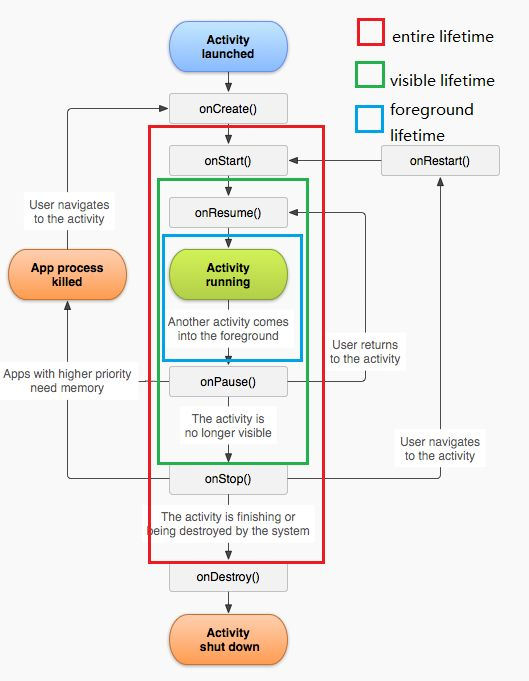
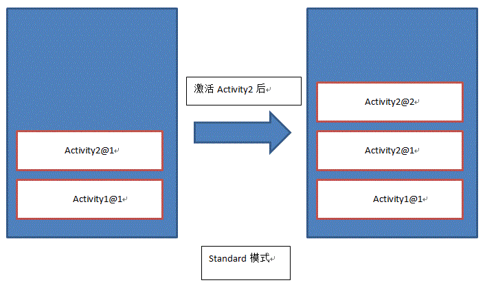
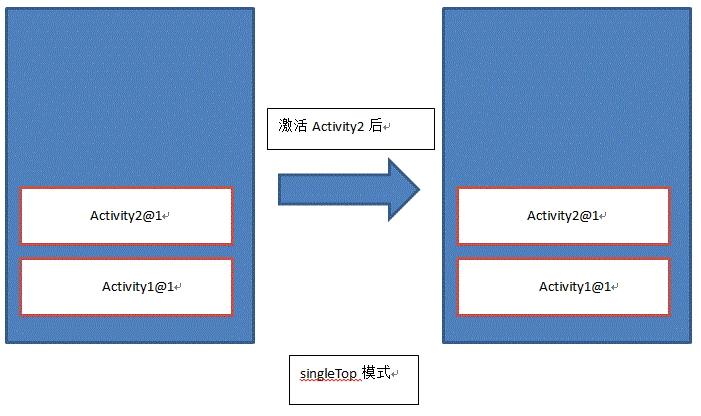
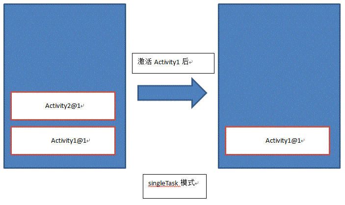
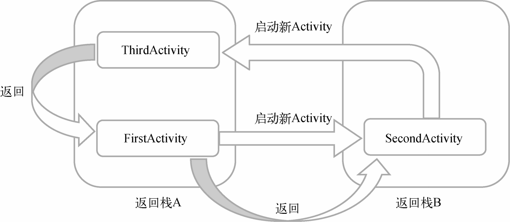

## 基本流程
Activity创建 -> inflate加载 -> Manifest注册

```kotlin
class FirstActivity : AppCompatActivity() { 
    override fun onCreate(savedInstanceState: Bundle?) {         				
    	super.onCreate(savedInstanceState) 
        //FirstLayoutBinding bind to name
        val binding = FirstLayoutBinding.inflate(layoutInflater) 								//setContentView(R.layout.first_layout) 
        setContentView(binding.root)
    }
```

## Manifest

指定Activity theme

```kotlin
<activity
    android:name=".DialogActivity"
    android:exported="true"
    android:theme="@style/Theme.AppCompat.Dialog">
    <meta-data
        android:name="android.app.lib_name"
        android:value="" />
```


The specification can be just a data type (the `mimeType` attribute), just a URI, or both a data type and a URI. A URI is specified by separate attributes for each of its parts:

`<scheme>://<host>:<port>[<path>|<pathPrefix>|<pathPattern>]`

```kotlin
<activity android:name=".SecondActivity" >
    <intent-filter>
        <data
        android:host="www.baidu.com"
        android:scheme="https" />
        ......
    </intent-filter>
</activity>
```

## Activity的生命周期

Android是使用任务（task）来管理Activity的，一个任务就是一组存放在栈里的Activity的集合，这个栈也被称作返回栈（back stack）。而每当我们按下Back键或调用finish()方法去销毁一个Activity时，处于栈顶的Activity就会出栈，前一个入栈的Activity就会重新处于栈顶的位置。系统总是会显示处于栈顶的Activity给用户。

https://blog.csdn.net/jingzz1/article/details/107338872

### Activity状态

- 运行状态
- 暂停状态
- 停止状态
- 销毁状态

### Activity的生存期

- onCreate()
- onStart()
- onResume()
- onPause()
- onStop()
- onDestroy()
- onRestart()

### Activity回收与恢复

指不经过生命周期，异常终止的Activity（内存不足，GC清理；后台杀死），用于恢复临时数据如文本输入框中输入一段文字

```
override fun onSaveInstanceState(outState: Bundle) {
    super.onSaveInstanceState(outState)
    val tempData = "Something you just typed"
    outState.putString("data_key", tempData)
}
```

```
override fun onCreate(savedInstanceState: Bundle?) {
    super.onCreate(savedInstanceState)
    setContentView(R.layout.activity_main)
    if (savedInstanceState != null) {
        val tempData = savedInstanceState.getString("data_key")
    }
    ...
}
```

## Activity的启动模式
启动模式一共有4种，分别是standard、singleTop、singleTask和singleInstance，可以在AndroidManifest.xml中通过给&lt;activity&gt;标签指定android:launchMode属性来选择启动模式。

- standard,对于使用standard模式的Activity，系统不会在乎这个Activity是否在返回栈中存在，每次启动都会创建一个该Activity的新实例。
- singleTop,每次扫描栈顶，如果在任务栈顶发现了相同的实例则重用，否则新建并压入栈顶。
- **singleTask**,与singleTop的区别是singleTask会扫描整个任务栈并制定策略。
    
- singleInstance,指定为singleInstance模式的Activity会启用一个新的返回栈来管理这个Activity（其实如果singleTask模式指定了不同的taskAffinity，也会启动一个新的返回栈）


https://hit-alibaba.github.io/interview/Android/basic/Android-LaunchMode.html#singleinstance
## Activity的最佳实践
- 知晓当前是在哪一个Activity：继承`BaseActivity（）`，实现`onCreate（）`时打印名称
- 随时随地退出程序：单例类`Activity`列表管理
- 启动Activity的最佳写法：调用`Activity`中用于传递参数的静态方法
```kotlin
//实现
companion object {
	fun actionStart(context:Context,data1:String,data2:String){
		val intent = Intent(context,SecondActivity::class.java)
		intent.putExtra("param1",data1)
		intent.putExtra("param2",data2)
		context.startActivity(intent)
	}
}
```
```kotlin
//调用
SecondActivity.actionStart(this,"data1","data2")
```
## 使用实现接口的方式来进行注册
```
class MainActivity : AppCompatActivity(), View.OnClickListener {
	override fun onCreate(savedInstanceState: Bundle?) {
		super.onCreate(savedInstanceState)
		setContentView(R.layout.activity_main)
		button.setOnClickListener(this)
	}
	override fun onClick(v: View?) {
		when (v?.id) {
			R.id.button -> {
			// 在此处添加逻辑
			}
		}
	}
}
```


