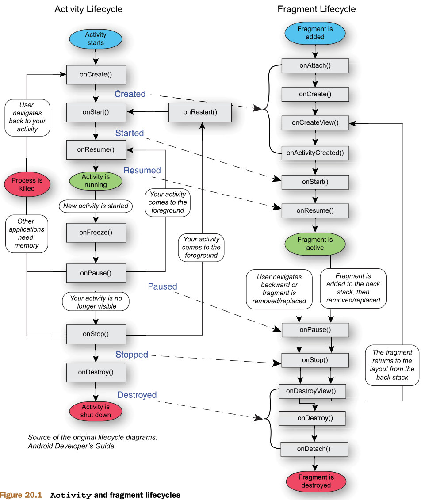

Fragment真正的强大之处在于，它可以在程序运行时动态地添加到Activity当中。根据具体情况来动态地添加Fragment，你就可以将程序界面定制得更加多样化。

## onActivityCreated()替代

```kotlin

override fun onAttach(context: Context) {
    super.onAttach(context)
    requireActivity().lifecycle.addObserver(object : LifecycleEventObserver {
        override fun onStateChanged(source: LifecycleOwner, event: Lifecycle.Event) {
            if (event.targetState == Lifecycle.State.CREATED) {
                isTwoPane= requireActivity().findViewById<View>(R.id.xxx)!=null
                val RV:RecyclerView=requireView().findViewById(R.id.RecyclerView)
                val layoutManager= LinearLayoutManager(requireActivity())
                RV.layoutManager=layoutManager
                RV.adapter=NewsAdapter(newsList)
                lifecycle.removeObserver(this)
            }
        }
    })

}
```

https://blog.csdn.net/NoMasp/article/details/49742475


## Fragment，Activity交互

```kotlin
//Fragment 调用 Activity中的控件
requireActivity().findViewById<View>(R.id.XXX)
// Fragment 调用同 Activity 下的Fragment
requireActivity().supportFragmentManager.findFragmentById()
//Activity 调用Fragment
supportFragmentManager.findFragmentById()
//Fragment 调用控件
fragment.requireView().findViewById(R.id.xxx)
```


##  动态替换Fragment

- 注意需要被替换的Fragment需要在`<FrameLayout>`中！！

```kotlin
private fun replaceFragment(fragment: Fragment){
    val fragmentManager=requireActivity().supportFragmentManager
    val transaction=fragmentManager.beginTransaction()
    transaction.replace(R.id.fragmentBackground,fragment)
    transaction.addToBackStack(null)
    transaction.commit()
    //fragmentManager.executePendingTransactions()执行全部commit但未运行的transaction
}
```


## 生命周期
Fragment总是依附于Activity而存在



http://landenlabs.com/android/info/activity-life-cycle/activity-life-cycle.html


