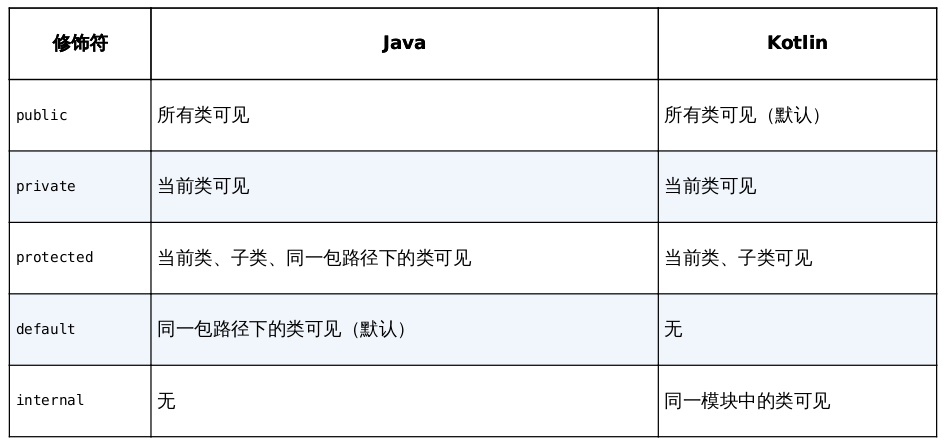

# 变量
- Kotlin中定义一个变量，只允许在变量前声明两种关键字：val和var
	- val(value),unchangable
	- var(variable),changable
-  可自动推类型导类型，如果我们对一个变量延迟赋值，需要显式地声明变量类型
-  Kotlin完全抛弃了Java中的基本数据类型，全部使用了对象数据类型`class Int`
	````kotlin
	lateinit val a:Int
	val a: Int = 10
	````
## 声明与初始化
Kotlin默认所有的参数和变量都不可为空
```kotlin
//全局变量延迟初始化替代初始化为null
//private var adapter: MsgAdapter? = null
//避免出现adapter?.notifyItemInserted(msgList.size - 1)
private lateinit var adapter: MsgAdapter 
    override fun onCreate(savedInstanceState: Bundle?) {       
        if (!::adapter.isInitialized) { 
            adapter = MsgAdapter(msgList) 
    	}
    }
	override fun onClick(v: View?) { 
		adapter.notifyItemInserted(msgList.size - 1) 
	}
```


# 函数
```kotlin
fun largerNumber(num1: Int, num2: Int): Int {
    return max(num1, num2)
}
```
# 逻辑控制
## 条件判断
### if
```
fun largerNumber(num1: Int, num2: Int): Int {
	var value = 0
	if (num1 > num2) {
		value = num1
	} else {
		value = num2
	}
	return value
}
```
Kotlin中if语句是可以有返回值的
```
fun largerNumber(num1: Int, num2: Int): Int {
	val value = if (num1 > num2) {
		num1
	} else {
		num2
	}
	return value
}
```
```
fun largerNumber(num1: Int, num2: Int) = if (num1 > num2) num1 else num2
```
### when
when语句和if语句一样，也是可以有返回值的，因此我们仍然可以使用单行代码函数的语法糖
```
fun getScore(name: String) = when (name) {
  //匹配值 -> { 执行逻辑 }
	"Tom" -> 86
	"Jim" -> 77
	"Jack" -> 95
	"Lily" -> 100
	else -> 0
}
```
类型匹配,Number类型的参数，是Kotlin内置的一个抽象类，像Int、Long、Float、Double等与数字相关的类都是它的子类
```
fun checkNumber(num: Number) {
	when (num) {
		is Int -> println("number is Int")
		is Double -> println("number is Double")
		else -> println("number not support")
	}
}
```
不带参数的用法
```
fun getScore(name: String) = when {
    name.startsWith("Tom") -> 86
    name == "Jim" -> 77
    name == "Jack" -> 95
    name == "Lily" -> 100
    else -> 0
}
```
## 循环语句
```kotlin
fun main() {
	//val range = 0..10
	//val range = 10 downto 1
	val range = 0 until 10
	for (i in 0 until 10 step 2) {
		println(i)
	}
}

```
## 数组与集合

传统意义上的集合主要就是List和Set，再广泛一点的话，像Map这样的键值对数据结构也可以包含进来。

```kotlin
//Returns a new MutableList with the given elements.
val list= mutableListOf<String>("A","B","C","D","E")
list.add("F")
//Returns a new read-only list of given elements. 
//val list= listOf("A","B","C","D","E")

    for (element in list){
        println(element)
    }
val map = mapOf("Apple" to 1, "Banana" to 2, "Orange" to 3, "Pear" to 4, "Grape" to 5)
for ((fruit, number) in map) {
	println("fruit is " + fruit + ", number is " + number)
}
```


    for (element in list){
        println(element)
    }
val map = mapOf("Apple" to 1, "Banana" to 2, "Orange" to 3, "Pear" to 4, "Grape" to 5)
for ((fruit, number) in map) {
	println("fruit is " + fruit + ", number is " + number)
}

# 面对对象

```
class Person {
	var name = ""
	var age = 0
	fun eat() {
	println(name + " is eating. He is " + age + " years old.")
	}
}

fun main() {
	val p = Person()
	p.name = "Jack"
	p.age = 19
	p.eat()
}
```
## 继承

在Kotlin中任何一个非抽象类默认都是不可以被继承的，相当于Java中给类声明了final 关键字,需要声明open

```
open class Person {
	...
}

class Student : Person() {
	var sno = ""
	var grade = 0
}
```
Java继承特性中的一个规定，子类中的构造函数必须调用父类中的构造函数，这个规定在Kotlin中也要遵守,子类的主构造函数调用父类中的哪个构造函数，在继承的时候通过括号来指定.

```
class BadStudent(val criminalrecord:String,sno:Int,grad:String):Student(sno,grade){
} 
```


## 构造函数 & 析构函数

Kotlin将构造函数分成了两种：主构造函数和次构造函数
### 主构造函数
每个类默认都会有一个不带参数的主构造函数，当然你也可以显式地给它指明参数。主构造函数的特点是没有函数体，直接定义在类名的后面即可。Kotlin给我们提供了一个init结构体，所有主构造函数中的逻辑都可以写在里面：
```
class Student(val sno: String, val grade: Int) : Person() {
	init {
		println("sno is " + sno)
		println("grade is " + grade)
	}
}
val student = Student("a123", 5) //可用val
```
### 次构造函数

- 基本没用

任何一个类只能有一个主构造函数，但是可以有多个次构造函数,次构造函数也可
以用于实例化一个类，这一点和主构造函数没有什么不同，只不过它是有函数体的.Kotlin规定，当一个类既有主构造函数又有次构造函数时，所有的次构造函数都必须调用主构造函数（包括间接调用）
```
class Student(val sno: String, val grade: Int, name: String, age: Int) :
Person(name, age) {
	constructor(name: String, age: Int) : this("", 0, name, age) {
	}
	constructor() : this("", 0) {
	}
}

val student1 = Student()
val student2 = Student("Jack", 19)
val student3 = Student("a123", 5, "Jack", 19)
```
首先Student类的后面没有显式地定义主构造函数，同时又因为定义了次构造函数，所以现在Student类是没有主构造函数的。那么既然没有主构造函数，继承Person类的时候也就不需要再加上括号了。另外，由于没有主构造函数，次构造函数只能直接调用父类的构造函数，上述代码也是将this关键字换成了super关键字
```
class Student : Person {
	constructor(name: String, age: Int) : super(name, age) {
	}
}
```
### 函数的可见性修饰符

## 接口
在接口中定义一系列的抽象行为，然后由具体的类去实现。**如果接口中的一个函数拥有了函数体，这个函数体中的内容就是它的默认实现。现在当一个类去实现Study接口时，只会强制要求实现readBooks()函数**，而doHomework()函数则可以由选择实现或者不实现，不实现时就会自动使用默认的实现逻辑。

```
interface Study {
	fun readBooks()
	fun doHomework() {}
}
```
Java中继承使用的关键字是extends，实现接口使用的关键字是 implements，而Kotlin中统一使用冒号，中间用逗号进行分隔。

```
class Student(name: String, age: Int) : Person(name, age), Study {
	override fun readBooks() {
		println(name + " is reading.")
	}
	override fun doHomework() {
		println(name + " is doing homework.")
	}
}
```
> **使用接口利于扩展**

```
fun main() {
	val student = Student("Jack", 19)
	doStudy(student)
}
//面向接口编程，也可以称为多态，
fun doStudy(study: Study) {
	study.readBooks()
	study.doHomework()
}
```
## 数据类与单例类
数据类通常需要重写equals()、hashCode()、toString()这几个方法。其中，equals()方法用于判断两个数据类是否相等。hashCode()方法作为equals()的配套方法，也需要一起重写，否则会导致HashMap、HashSet等hash相关的系统类无法正常工作。toString()方法用于提供更清晰的输入日志，否则一个数据类默认打印出来的就是一行内存地址。
```
data class Cellphone(val brand: String, val price: Double)
```
```
fun main() {
	val cellphone1 = Cellphone("Samsung", 1299.99)
	val cellphone2 = Cellphone("Samsung", 1299.99)
	println(cellphone1)
	println("cellphone1 equals cellphone2 " + (cellphone1 == cellphone2))
}
```
[单例模式](https://www.runoob.com/design-pattern/singleton-pattern.html#:~:text=%E5%8D%95%E4%BE%8B%E6%A8%A1%E5%BC%8F%EF%BC%88Singleton%20Pattern,%E5%8C%96%E8%AF%A5%E7%B1%BB%E7%9A%84%E5%AF%B9%E8%B1%A1%E3%80%82)（Singleton Pattern）是 Java 中最简单的设计模式之一。这种类型的设计模式属于创建型模式，它提供了一种创建对象的最佳方式。这种模式涉及到一个单一的类，**该类负责创建自己的对象**，同时**确保只有单个对象被创建**。这个类提供了一种访问其唯一的对象的方式，可以直接访问，**不需要实例化该类的对象**。

```java
//java
public class Singleton { 
    private static Singleton instance; 
    private Singleton() {} 
    public synchronized static Singleton getInstance() {         if (instance == null) { 
            instance = new Singleton(); 
        } 
        return instance; 
    } 
    public void singletonTest() { 
        System.out.println("singletonTest is called.");     } 
}

Singleton singleton = Singleton.getInstance();
singleton.singletonTest();
```

```
//kotlin
object Singleton {
	fun singletonTest() {
		println("singletonTest is called.")
	}
}

Singleton.singletonTest()
```
## Lambda编程

**Lambda就是一小段可以作为参数传递的代码。**

```
//.maxBy:函数式API
val maxLengthFruit = list.maxBy({ fruit: String -> fruit.length })
//Kotlin规定，当Lambda参数是函数的最后一个参数时，可以将Lambda表达式移到函数括号的外面
val maxLengthFruit = list.maxBy() { fruit: String -> fruit.length }
//如果Lambda参数是函数的唯一一个参数的话，还可以将函数的括号省略
val maxLengthFruit = list.maxBy { fruit: String -> fruit.length }
//由于Kotlin拥有出色的类型推导机制，Lambda表达式中的参数列表其实在大多数情况下不必声明参数类型
val maxLengthFruit = list.maxBy { fruit -> fruit.length }
//当Lambda表达式的参数列表中只有一个参数时，也不必声明参数名，而是可以使用it关键字来代替
val maxLengthFruit = list.maxBy { it.length }
```
```
val list = listOf("Apple", "Banana", "Orange", "Pear", "Grape", "Watermelon")
val newList = list.filter { it.length <= 5 }.map { it.upperCase() }
```

### Java函数式API

如果我们在Kotlin代码中调用了一个Java方法，并且该方法接收一个**Java单抽象方法接口参数**，就可以使用函数式API。
```
//单抽象方法接口
public interface OnClickListener {
	void onClick(View v,String name);
}

//java
button.setOnClickListener(new View.OnClickListener() {
	@Override
	public void onClick(View v,String name) {
	}
});

//kotlin
button.setOnClickListener(object: View.OnClickListener() {
	over fun onClick(v:View, name:String) {
	}
})

//kotlin
button.setOnClickListener {v,name ->
}
```

# 空指针检查

如果我们向doStudy()方法传入了一个null参数，那么毫无疑问这里就会发生空指针异常。
```
//java
public void doStudy(Study study) {
	study.readBooks();
	study.doHomework();
}
```
**Kotlin默认所有的参数和变量都不可为空，所以这里传入的Study参数也一定不会为空，我们可以放心地调用它的任何函数。**

```
fun doStudy(study: Study) {
	study.readBooks()
	study.doHomework()
}
```
比如，Int表示不可为空的整型，而Int?就表示可为空的整型；String表示不可为空的字符串，而String?就表示可为空的字符串。
```
val student01:Student
doStudy(student01)

fun doStudy(study: Study?) {
	study?.readBooks()
	study?.doHomework()
}
```
?.操作符表示对象为空时什么都不做，对象不为空时就调用let函数，而let函数会将study对象本身作为参数传递到Lambda表达式中
```
fun doStudy(study: Study?) {
	study?.let {
		it.readBooks()
		it.doHomework()
}
}
```