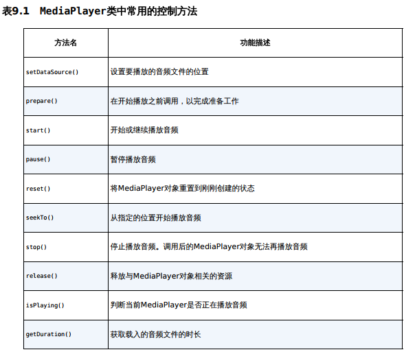

## Notification

- 流程`NotificationManager -> NotificationChannel -> Notification`
- 可以在Activity,BroadcastReceiver,Servive中创建

```kotlin
override fun onCreate(savedInstanceState: Bundle?) {
    super.onCreate(savedInstanceState)
    val binding= ActivityNotificationBinding.inflate(layoutInflater)
    setContentView(binding.root)
    //全局唯一
    val channelId="0"
    val channelName="通知"
    //HIGH,DEFAULT,LOW,MIN
    val importance= NotificationManager.IMPORTANCE_HIGH
    
    val manager=getSystemService(Context.NOTIFICATION_SERVICE) as NotificationManager
    manager.createNotificationChannel(NotificationChannel(channelId,channelName,importance))
    val intent=Intent(this,NormalActivity::class.java)
    //使用androidx中的NotificationCompat兼容所有版本
    val notification=Notification.Builder(this,channelId)
    	//PendingIntent实现跳转
        .setContentIntent(PendingIntent.getActivity(this,0, intent,PendingIntent.FLAG_IMMUTABLE))
        .setContentTitle("Title")
        .setContentText("TextTextText")
        .setSmallIcon(R.drawable.ic_launcher_foreground)
        .setAutoCancel(true)
        .setStyle(Notification.BigPictureStyle().bigPicture(
            BitmapFactory.decodeResource(resources,R.drawable.banana)))
        .setLargeIcon(BitmapFactory.decodeResource(resources,R.drawable.apple))
        .build()
    //notification 唯一ID
    manager.notify(0,notification)
    //manager.cancel(0)
}
```


## Media files

- 使用`MediaPlayer`与`VideoView`实现
- `VideoView`是对`MediaPlayer`进行简单封装




- audio放在assets中,使用assetsManager进行管理;video放在raw中,使用R进行管理

```kotlin
val assetManager=assets
val fd=assetManager.openFd("asking-for-a-date.mp3")
mediaPlayer.setDataSource(fd.fileDescriptor,fd.startOffset,fd.length)
```

- 记得释放

```kotlin
mediaPlayer.stop()
mediaPlayer.release()
videoView.suspend()
```

