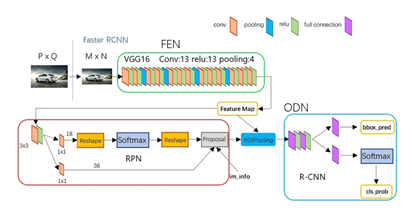
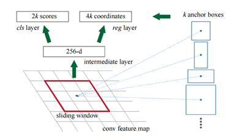
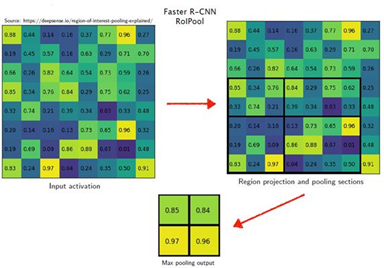

## Faster R-CNN原理

​	下图给出了Faster R-CNN网络的基本框架，主要由特征提取网络（FEN），区域生成网络（RPN）与目标监测网络（ODN）组成。对于输入图像，利用经过训练的卷积神经网络进行特征提取，RPN接收FEN的输出特征图（Feature Map）生成一系列候选区域，最后ODN根据RPN产生的候选区域的位置在FEN的输出特征图中利用RoI （Region of Interest）pooling对候选区域进行进一步特征提取，之后由ODN进行目标分类和边界框回归预测。

​	与R-CNN和Fast RCNN相比Faster R-CNN使用了RPN替代了传统的Selective Search（SS）算法来生成特征图的候选区域，在速度上有了显著的提升。SS使用CPU处理一张图像的时间约为2s，而使用GPU的RPN处理一张图像的时间约为10ms，在K40 GPU上使用VGG作为FEN，使用SS的帧率为0.5fps，而使用RPN的帧率为5fps。

## 特征提取网络（FEN）

基础的特征提取网络一般来说是一个常用的经典网络模型，如经典的VGG16，能够在深层卷积下保留原始特征的残差网络Resnet-50与Resnet-101，或者是更多用于移动设备的轻量级网络MobileNetv3。通常来说FEN会通过迁移学习进行训练，及FEN首先使用大规模的数据集如COCO，VOC，ImageNet进行预训练（Pre-train），之后加上RPN层后进行微调（fine-tuning）。使用优秀的预训练网络可以节省大量的训练时间，提高训练效率，在数据集相似度高的情况下对提升训练精确度有一定的效果。

## 区域生成网络（RPN）

RPN接收来自FEN生成的特征图生成一系列矩形候选区域与对应的目标预测分数。RPN首先采用一个3×3的卷积层对特征图进行一次卷积，并保持输出维度（dimension）不变，之后利用３种不同长宽比和３种不同尺度以每个滑动点为中心生成9个锚点，在采用VGG16作为FEN进行16倍下采样的情况下一共产生了W/16×H/16×9（下记为m）个锚点，之后通过边缘框回归全连层与分类回归全连层生成锚点对应的4m×1×1边缘框回归预测值与2m×1×1目标预测分数

## 锚点选择

对于一幅经RPN处理的图像，如果对所有生成的锚点都进行分类与边界框回归将产生大量的时间开销，因此需要对生成的锚点进行选择。Faster R-CNN中锚点的选择依据锚点边缘框预测值与GT（Ground Truth）之间的IoU值来确定，每次选择256个锚点作为mini-batch方便批处理：在IoU>0.7的锚点中随机选取128个正锚点，在IoU<0.3的锚点中随机选取128个负锚点进行训练，当正锚点少于128个时使用负锚点来补全mini-batch

## RoI pooling

RoI pooling可以将任意大小的候选区域池化成一个特定长宽的向量，使得网络对输入图像的格式不再有固定的要求，极大方便了训练操作。在使用VGG16作为FEN的Faster R-CNN中RoI pooling将任意长宽候选区域池化成7×7×512的向量，512为向量的维度，池化过程中保持不变。

