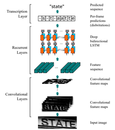
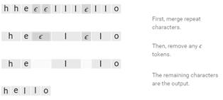
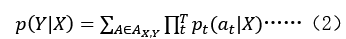

## OCR模型

OCR（Optical Character Recognition）是指对文本资料的图像文件进行分析识别处理，获取文字及版面信息的过程。图像输入，图像预处理，文字检测，文本识别，文本输出构成了一个完整的 OCR 系统。文字检测主要解决哪里有文字的问题，一般是对整个图像中所有文字的检测，检测结果为一行行较规范的文字。文本识别是在文本检测的基础上，对每行文本内容进行识别，主要解决文字是什么的问题。一个基本的 OCR 模型如下图所示。本项目所采用的OCR模型利用YOLOv3进行文字检测，CRNN进行文本识别，在通用文本数据集进行训练。

##  CRNN

CRNN模型主要由卷积层，循环层，转录层三部分组成：卷积层用于输入文字图像的特征提取，将输入图像统一放缩为160×32×1，输出特征图尺寸固定为40×1×512；循环层使用双向LSTM来联系输入特征向量的上下文，利用特征向量进行学习，预测标签序列的概率分布；转录层使用CTC loss将预测标签序列的概率分布转化为最终的输出序列标签。

##  CTC loss

RNN进行序列预测时，不可避免地会出现很多冗余信息，如一个字母被连续识别两次，对预测标签序列的概率分布与最终的序列标签来说，其长度与比例为可变的，并且会出现多对一的情况。CTC引入了blank标记（ϵ），先进行重复词汇的合并，再移除ϵ之后剩余的字母作为最终的输出序列标签。

CTC条件概率公式（2），通过构建合适的Loss函数，在反向传播过程中让p(Y│X)得到最大，从而得到最终的输出序列标签。
	