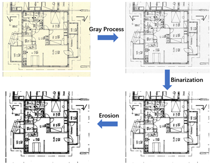

- 原始的图像质量不一，存在黄底，线条模糊，颜色较浅等问题，使用opencv-python（cv2）库对原始的工程图纸进行图像预处理，采用灰度处理（Gray Process），二值化（Binarization）与腐蚀（Erosiono）处理，具体的处理代码如下，图像处理流程与效果如下图所示。

```python
image=cv2.imread(os.path.join(path_im,image_name))
image=cv2.cvtColor(image,cv2.COLOR_BGR2GRAY)
_,image=cv2.threshold(image,200,255,0)
erosion_size=1
element = cv2.getStructuringElement(1,(2 * erosion_size + 1, 2 * erosion_size + 1),
                                    (erosion_size, erosion_size))
image=cv2.erode(image,element)
cv2.imwrite(os.path.join(path_out,out_image_name),image)
```




- 对图像进行放缩，图像尺寸不超出min_size=600和max_size=1000的限制，匹配Anchor感受野的大小，防止丢失过多原始特征。

```python
C, H, W = img.shape
scale1 = min_size / min(H, W)
scale2 = max_size / max(H, W)
scale = min(scale1, scale2)
img = img / 255.
img = sktsf.resize(img, (C, H * scale, W * scale), mode='reflect',anti_aliasing=False)
```


- 之后对图像进行批归一化Batch normalization（BN）处理，前3500张图像作为计算样本，计算出每个通道的均值与标准差，对全部图像进行处理。

```python
ids = []
for root, dirs, files in os.walk(pic_dir):
    for file in files:
        if os.path.splitext(file)[1] == '.png':
            ids.append(file)
random.shuffle(ids)  # shuffle images
for i in tqdm(range(CNum)):
    img_path = os.path.join(pic_dir, ids[i])
    img = cv2.imread(img_path)
    img = cv2.resize(img, (img_w, img_h))
    img = img[:, :, :, np.newaxis]
    imgs = np.concatenate((imgs, img), axis=3)
    del img
    gc.collect()
imgs = imgs.astype(np.float32) / 255.
for i in tqdm(range(3)):
    pixels = imgs[:, :, i, :].ravel()  
    # flatten 
    # avg of RGB channel
    #batch norm    
    means.append(np.mean(pixels))
    stdevs.append(np.std(pixels))
normalize = tvtsf.Normalize(mean=means, std=stdevs)
img = normalize(torch.from_numpy(img))
```

