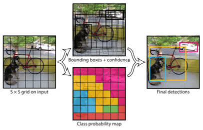
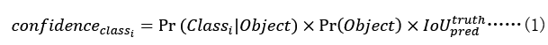
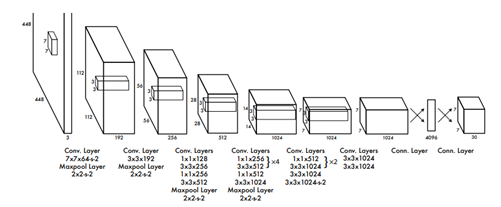
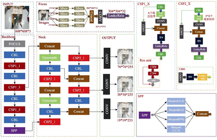

## YOLO原理

不同于Faster R-CNN,Fast R-CNN等先生成候选区域，再对最大可能候选区域进行回归预测的两阶段识别算法，YOLO（you only look once）将目标检测作为一个简单的回归问题，正如其名字所指明的一样，YOLO通过一次直接从原图像中生成边缘框预测与分类的可能性，大大提高了目标检测的速度。

由24层卷积层与2层全连层形成的基本网络模型在Titan X GPU上达到了45fps,而由9层卷积层与更少卷积核形成的快速网络模型在Titan X GPU上超过了150fps，这意味着YOLO可实现低延迟的实时流视频处理。但由于YOLO仅进行固定的网格分割与较少的预测结果，在VOC 2012数据集上YOLO的mAP为57.9%，而Faster R-CNN的mAP为70.4%，而采用Fast R-CNN+YOLO的混合模型可达到70.9%。

## 统一检测

YOLO同时生成对边缘框与分类的可能性进行预测，根据边缘框的分类置信度得到最终的检测结果。具体做法是先将输入图像调整为448×448的大小，通过基本的卷积网络将图像转化成S×S×(B×5+C)的向量，其中S×S将图像分割成S×S的网格结构，B表示预测的边缘框数量，边缘框参数包括边缘框中心坐标（x,y）的预测值，相对整张图像长宽的比例预测值，与边缘框预测值与GT之间的IoU值，当IoU值高于阈值时Pr⁡(Object)=1，否则Pr⁡(Object)=0。C表示分类的可能性预测值，再利用分类置信度公式(1) 得到最终的检测结果。

使用YOLO预测PASCAL VOC测试集，使用S=7,B=2，由于PASCAL VOC有20种分类，因而C=20，得到图5中的基本网络结构，最终的预测值为7×7×30的向量。

## YOLOv5的改进

YOLO模型自从诞生之后经历了多年的发展，从YOLOv2引入批量标准化（Batch Normalization）与锚点，到YOLOv3将骨干网络改进为darknet-53并将三个不同层级的输出特征图进行融合，再到YOLOv4多种技巧（Tricks）的运用与YOLOv5的Focus结构与各种对图片进行预处理的技巧，其网络结构已经发生了巨大的变化，但其本质仍然是一次性得到边缘框预测与分类的可能性，并在不断改进的过程