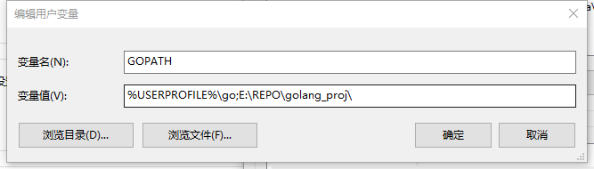
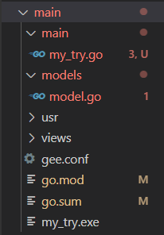
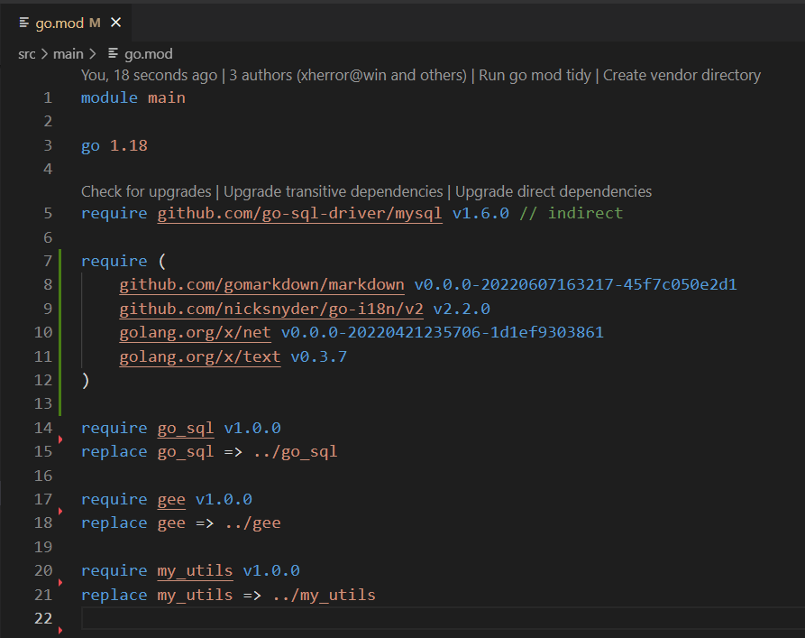
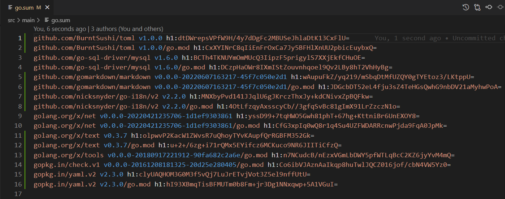
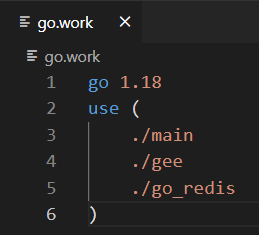

 ## [GO安装](https://zhuanlan.zhihu.com/p/62148085)
 注意：
 *  GO最开始使用**GOPATH**进行包管理，GO1.5引入[**VENDOR**](https://zhuanlan.zhihu.com/p/374044583)概念，而GO1.11引入了**GO111MODULE**概念，导致GO的包管理较为混乱，下面会备注不同包管理方式的区别。
 *  下文先是在**无IDE**下进行GO的编译与包管理，再讨论使用VSCODE作为IDE编译GO时的常见问题
* **GOROOT**，GO安装的根目录。该变量在不同的版本需要选择不同的处理方式。在 GO 1.10 之前，我们需要视不同安装方式决定是否手动配置，在 **GO 1.10 及以后**，这个变量已经**不用**我们设置了，go命令决定GOROOT的位置。
* **PATH**，各个操作系统都存在的环境变量，用于指定系统可执行命令的默认查找路径，在不写完整路径情况下执行命令。以Windows为例，我之前把go安装在 C:\Program Files\go目录下，即**GOROOT为C:\Program Files\go，那么PATH变量可追加上C:\Program Files\go\bin**。


## 使用GOPATH[不太推荐]

* 使用GOPATH进行包管理，对文件目录有**严格**要求，所有包都要在`$GOPATH/src`下

#### 设置GO111MODULE关闭
```
>go env -w GO111MODULE=off
```


#### GOPATH设置

* Windows搜索框->高级系统设置->环境变量->选中GOPATH->编辑->变量值：`%USERPROFILE%\go;E:\Your\go\work\path`


* Linux
	```
	$ sudo vim /etc/profile
	...
	export GOROOT=/usr/local/go         // 默认位置可不用设置，1.10版本后也可以不设置
	export PATH=$PATH:$GOROOT/bin
	export GOPATH=/home/xherror/REPO/mysql_golang  // 可设置多个目录
	```
* 或者使用go env设置，但**无法覆盖**上面两种方法设置的路径
	```
	go env -w GOPATH=/home/xherror/REPO/mysql_golang
	```


#### 文件目录管理
GOPATH 具体结构如下，必须包含三个文件夹，具体如下图所示：
```
GOPATH
├── bin              //编译生成的二进制文件
├── pkg              //预编译文件，以加快程序的后续编译速度
|── src              //所有源代码
    ├── github.com
    ├── golang.org
    ├── yourcode
	├── ...
	
```
例如：
创建项目名为main，放在GOPATH/src下，`import (	"github.com/nicksnyder/go-i18n/v2/i18n","golang.org/x/net/websocket")`,文件组织结构如下：
 ```
 GOPATH=/home/xherror/REPO/mysql_golang
├── bin             
├── pkg             
|── src              
    ├── github.com
		 ├──nicksnyder/go-i18n/v2/i18n
    ├── golang.org
		 ├──x/net/websocket
    ├── main
		 ├──try.go
```

## [使用GO111MODULE[推荐]](https://www.jianshu.com/p/760c97ff644c)
#### 设置GO111MODULE开启
`&go env -w GO111MODULE=on`
#### 设置GOPROXY，如果在使用go get时连接超时
`&go env -w GOPROXY=https://goproxy.cn,direct`
#### go mod初始化与文件目录管理
```
>mkdir main

>cd ./main

>go mod init main  //创建main做为module 
create a new go.mod file 

 //创建main,models文件夹，在其中创建my_try.go与model.go文件
 //相当于main module 包含main与models两个package
>mkdir {main,models}

>cat go.mod
module main

go 1.18
```

再加上其他一些内容，最后文件的组织方式如图所示，忽略报错



在my_try.go中引入的三种module与package关系

```
package main  //package 声明

import (

    "fmt" //系统包
    "html/template"
    
    "gee/config" //本地自建包
    "gee/gee"
    ."my_utils"

    "github.com/nicksnyder/go-i18n/v2/i18n" //外来包
    "golang.org/x/net/websocket"
)
```

- 对于系统包可直接使用
- 对于本地自建包，需要在**go.mod**添加module本地位置，版本自定义：

```
require gee v1.0.0
replace gee => ../gee

require my_utils v1.0.0
replace my_utils => ../my_utils
```

- 对于外来包

```
>go run ./main/my_try.go
models\model.go:7:2: no required module provides package github.com/nicksnyder/go-i18n/v2/i18n; to add it:
    go get github.com/nicksnyder/go-i18n/v2/i18n

//go get 下载module，储存在$GOPATH/pkg内
//go.sum也会添加依赖关系
>go get github.com/nicksnyder/go-i18n/v2/i18n

//之后go run可顺利运行
>go run my_try.go
START LISTEN 
```



## 使用VSCODE+GO111MODULE[推荐]
#### 安装GO插件

#### 安装工具流,超时见GOPROXY的设置
```
ctrl+shift+p>Go:Install/Update Tools  
```
#### 单MODULE开发
* 工作路径为MODULE所在文件夹，如main做为module，此时`PWD=E:\REPO\golang\main`    
#### [多MODULE开发[新]](https://studygolang.com/articles/35547)
* 配置go.work文件
```
>$PWD
E:\REPO\golang
>go work init
```
此时文件目录结构为
 ```
 PWD=E:\REPO\golang
  ├── main             
  ├── gee            
  |── go_redis
  |── ...
go.work
```

#### 5.常见报错
>Error loading workspace: You are outside of a module and outside of $GOPATH/src. If you are >using modules, please open your editor to a directory in your module. If you believe this >warning is incorrect, please file an issue: https://github.com/golang/go/issues/new.
* 工作路径错误，**使用GOPATH时，路径为$GOPATH/src，使用MODULE时，路径如上所述**
## 5.后续
* 第一次写文章，更多的是总结和自己学习思考的过程，难免有问题
* 写文章耗费时间比想象中的多
* 23/06/2022 22:50