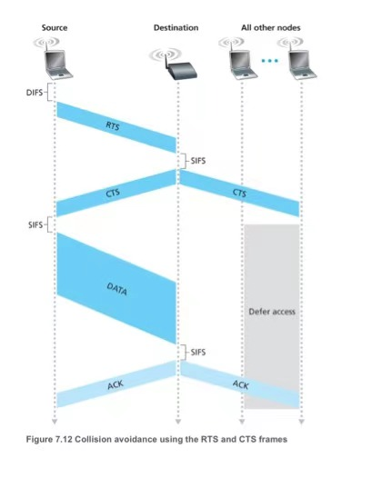
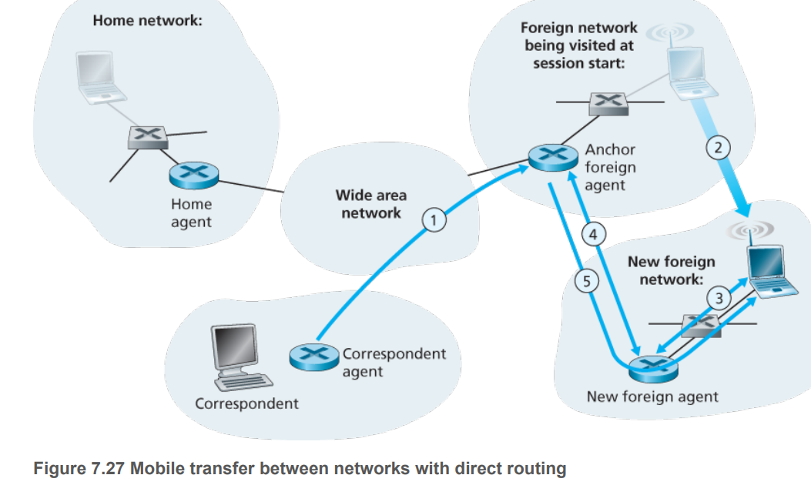

# 基础
## 不同WN标准

## WN特点
- BER,传输速率与SNR的关系

- 终端屏蔽

- 信号衰弱

## Impact on Higher-Layer Protocols(TCP)
- high bit error rates on wireless links and the possibility of handoff loss, TCP’s congestion-control response could be problematic in a wireless setting.
- **Local recovery**. Local recovery protocols recover from bit errors when and where (e.g., at the wireless link) they occur, use both ARQ(RTS/CTS) and FEC(WIFI CRC) 
- **TCP sender awareness of wireless links**.
- **Split-connection approaches**.one from the mobile host to the wireless access point(usually TCP), and one from the wireless AP to the other communication end point(TCP/error recovery UDP).split TCP connections are widely used in cellular data networks,
# WLAN
## WIFI
### IEEE801.11标准

### 信道
- 2.4GHz段[2.4-2.485GHz],因为很多电子设备普遍都采用了2.4GHz的无线频率,容易受影响
	- 有13个信道,其中1.6.11为相互不覆盖信道,14一般不用

- 5GHz段[5.1-5.8GHz]为WIFI专用段,但传播能力较差
### AP发现Beacon与Probe

### 调制OFDM
- 不同频率的正弦波乘积后积分为零
#### 时域下OFDM

#### 频域下OFDM

OFDM的子载波间隔最低能达到奈奎斯特带宽，也就是说（在不考虑最旁边的两个子载波情况下），OFDM达到了理想信道的频带利用率

### 多路访问CSMA/CA+RTS/CTS
#### CSMA/CA

- 监听到信道空闲,首先需要 "等待" DIFS时间，若DIFS时间内，信道保持空闲状态，那么就可以进行backoff过程
- backoff过程遵循BEB(Binary Exponential Back off)机制,默认为[0,31]
#### RTS/CTS
- RTS(request to send),CTS(clear to send)
- 默认设置RTS大于MTU,不开启RTS/CTS模式

### 格式
07U.png)
- Type与Subtype区分ACK,RTS,CTS,DATA,etx
- Duration为RTS/CTS
- Addr1为接收方MAC(AP/Node),Addr2为发送方MAC(AP/Node),Addr3为AP下一跳Router的MAC,Addr4用于ANET
### 帧类型

### 移动性
#### 同一网段下移动

AP2发送一带有新MAC的广播帧
#### 不同网段下移动
##### 间接路由
当Node移动到新网段时,会向FA注册,FA通知HA

之后的数据包经HA转发

##### 直接路由

再次移动时FA不再改变,做为AFA转发信息

#### 间接路由ICMPv4协议实现
- **Agent discovery**. Mobile IP defines the protocols used by a home or foreign agent to advertise its services to mobile nodes, and protocols for mobile nodes to solicit the services of a foreign or home agent.
	-  The agent periodically broadcasts an ICMP message with a type field of 9 (router discovery) on all links to which it is connected
	- With agent solicitation, a mobile node wanting to learn about agents without waiting to receive an agent advertisement can broadcast an agent solicitation message, which is simply an ICMP message with type value 10

- **Registration with the home agent**. Mobile IP defines the protocols used by the mobile node and/or foreign agent to register and deregister COAs with a mobile node’s home agent.
	- The foreign agent then sends a mobile IP registration message (again, within a UDP datagram) to port 434 of the home agent. The message contains the COA, HA, MA, etc

- **Indirect routing of datagrams**. The standard also defines the manner in which datagrams are forwarded to mobile nodes by a home agent, including rules for forwarding datagrams, rules for handling error conditions, and several forms of encapsulation

### 电量管理
- A node indicates to the access point that it will be going to sleep by setting the power-management bit in the header of an 802.11 frame to 1
- A timer in the node is then set to wake up the node just before the AP is scheduled to send its beacon frame (recall that an AP typically sends a beacon frame every 100 msec)
- Since the AP knows from the set power-transmission bit that the node is going to sleep, it (the AP) knows that it should not send any frames to that node, and will buffer any frames destined for the sleeping host for later transmission.
- wakeup before the AP sends a beacon frame ,requires only 250 microseconds
- If there are no buffered frames for the node, it can go back to sleep. Otherwise, the node can explicitly request that the buffered frames be sent by sending a polling message to the AP
- a node that has no frames to send or receive can be asleep 99% of the time, resulting in a significant energy savings

### 无线网卡
- 监听(monitor)模式允许网卡不用连接wifi就可以抓取特性频道的数据，就是在空气中抓取某个波段的数据。可以用在破解wifi密码上
- 混杂(promiscuous)模式（连接wifi）就是接收所有经过网卡的数据包，包括不是发给本机的包，即不验证MAC地址
## Bluetooth

- slave can transmit only after the master has communicated with it in the previous slot and even then the slave can only transmit to the master
- In addition to the slave devices, there can also be up to 255 parked devices in the network
- 802.15.1 can provide data rates up to 4 Mbps.
### 帧格式

### FHSS(frequency-hopping spread spectrum)
802.15.1 networks operate in the 2.4 GHz unlicensed radio band in a TDM manner, with time slots of 625 microseconds. During each time slot, a sender transmits on one of 79 channels, with the channel changing in a known but pseudo-random manner from slot to slot
## Zigbee
### 帧格式

# Mobile Network
## 3G网结构

## 移动性

http://gaia.cs.umass.edu/kurose_ross/online_lectures.htm

https://blog.csdn.net/fengfeng0328/article/details/112798288

https://zhuanlan.zhihu.com/p/20721272

https://blog.csdn.net/madongchunqiu/article/details/18614233?utm_source=app&app_version=5.0.0