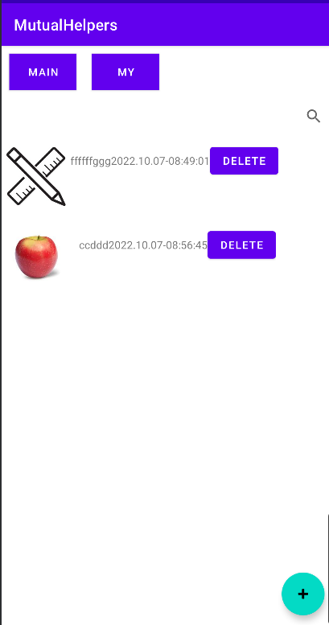

# PSP数据统计

## 计划

在疫情期间，各个小区居民发挥互助精神，进行物品交换，互通有无。编写一个物品交换软件

该程序允许添加物品的信息，删除物品的信息，显示物品列表，也允许查找物品的信息。

利用国庆期间，结合本学期所学习的安卓原生开发知识，开发一个简单的物品交换APP，实现以上功能

## 开发

### 需求分析

- 允许添加物品的信息，删除物品的信息✓
- 显示物品列表✓
- 查找物品的信息✓
- （附加）用户管理X
- （附加）分类与模糊查询X

### 具体设计

主要以Activity+三个Fragment为整体框架，利用transaction实现我的物品与全部物品的切换，搜索框采用SearchView实现，添加物品的信息采用悬浮按键FloatingActionButton+Intent实现，物品列表利用RecyclerView实现

## 记录用时

```
release:MutualHelper-v1.1N 		 --2022/10/7 19.46
release:MutualHelper-v1.0  		 --2022/10/7 11:31
TODO:load image        		     --2022/10/6 23:13
TODO:upload image        	     --2022/10/6 0:24
init                 	         --2022/10/5 20:01
```

大致用时三天，在图片上传，储存，加载方面用时较久，在DEBUG方面也耗费较多时间

## 测试报告

UI美观方面较差，基本逻辑处理正确，但图片上传存在不同步的BUG

 

## 事后总结

- 安卓开发学习的一次实践。还有很多需要学习的地方
- 整体框架设计较为混乱，存在冗余代码
- 局部耦合与分离没有明确

## 改进计划

- 完善用户管理

- 优化查询

- 将数据库转移道服务器，实现线上交互

  [项目仓库](https://github.com/gxherror/MutualHelpers)

  [APP安装包](https://github.com/gxherror/MutualHelpers/blob/main/app/release/app-release.apk)