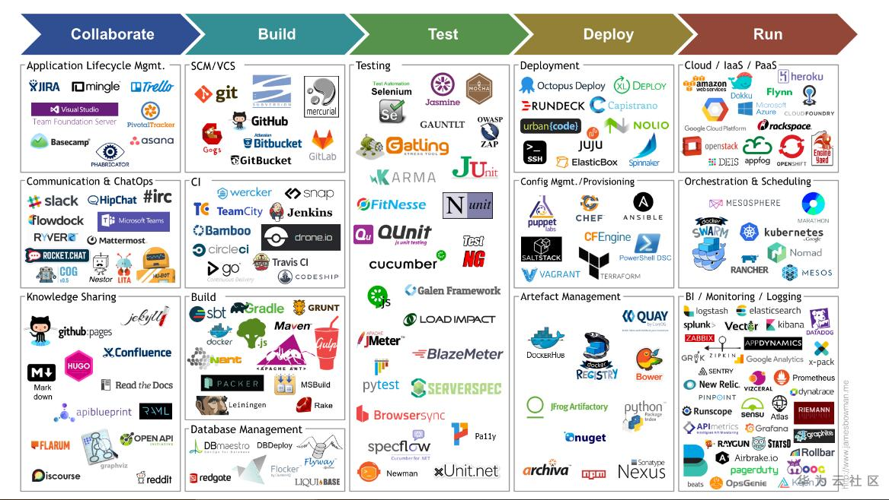

## 基本概念

软件工程是指导计算机软件开发和维护的一门工程学科。采用工程的概念、原理、技术和方法来开发与维护软件，把经过时间考验而证明正确的管理技术和当前能够得到的最好的技术方法结合起来，以经济地开发出高质量的软件并有效地维护它。

我理解的软件工程基本是DevOps链，即计划->开发->测试->部署->运行这一系列流程的管理。

## 软件工程7条基本原理

- 用分阶段的生命周期计划严格管理
- 坚持进行阶段评审
- 实行严格的产品控制
- 采用现代程序设计技术
- 结果应能清楚地审查
- 开发小组的人员应该少而精
- 承认不断改进软件工程实践的必要性

## 软件工程方法学

- 传统方法：面向过程设计，以计算为核心，数据与操作分离，不
  易理解
- 面向对象方法学：把数据和行为看成是同等重要的，它是一种以数据为主线，把数据和对数据的操作紧密地结合起来的方法

## 软件过程模型

- 瀑布模型
- 快速原型
- 增量模型
- 螺旋模型
- 喷泉模型
- 极限编程XP模型
- 微软过程