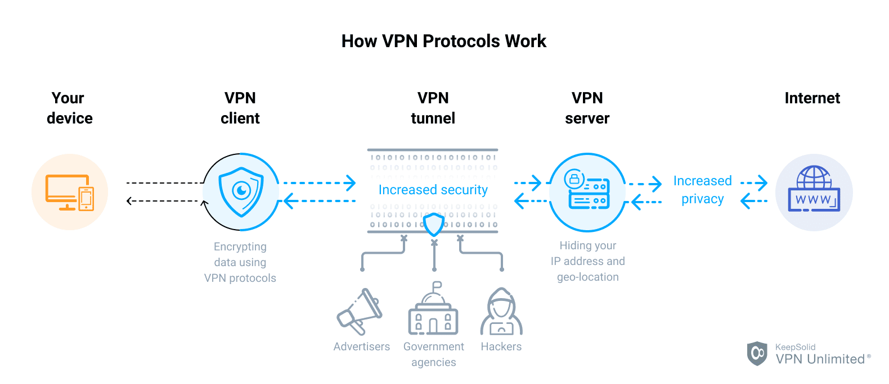

## 封锁

### DNS污染和劫持

- 使用OpenDNS（208.67.222.222）或GoogleDNS（8.8.8.8）
- 使用一些第三方的DNS服务器
- 自己用VPS搭建DNS服务器
- 修改机器host文件，直接IP访问

### 封锁IP

- 使用VPS搭建代理
- 使用IPV6 （IPV6地址巨大，采用封地址不现实，但是目前国内只有部分高校部署了IPV6）

### 封锁代理

- URL或IP地址检测
- 对弱加密方式的协议暴力破解检查传输内容(PPTP)
- 传输特征检测(OPENVPN)
- 流量监控
- 深度数据包检测(DPI)

## 方法/协议

### HTTP/HTTPS代理

- 
- 对于HTTP代理来说，封锁起来非常简单。因为HTTP协议是明文，Request Message中就带有要请求的URL或IP地址，这样很容易就被检测到。对于HTTPS来说，虽然通信是进行加密了，但是在建连之前会给代理服务器发送CONNECT方法，这里也会带上要访问的远端服务器地址。

### VPN

- VPN有多种协议：OPENVPN、PPTP、L2TP/IPSec、SSLVPN、IKEv2 VPN，Cisco VPN等。其中的PPTP和L2TP是明文传输协议。只负责传输，不负责加密。分别利用了MPPE和IPSec进行加密。
- 

### Socks代理

- [socks5协议的工作过程和协议细节](https://wiyi.org/socks5-protocol-in-deep.html)
- 
- 尽可能透明地进行操作
- 运行在session层
- SOCKS代理还可以转发UDP流量和反向代理，而HTTP代理不能
- Socks代理本身协议是明文传输，虽然相对HTTP有一些优势，但是明文也导致Socks代理很容易被封

### [SSH Socks](https://ma.ttias.be/socks-proxy-linux-ssh-bypass-content-filters/)

- 
- SSH加密传输实现Socks
- SSH一般是小流量数据，如果数据量特别大，容易因流量监控封锁

### Shadowsocks(SS)/SSR

- 
- 简单理解的话，shadowsocks 是将原来 ssh 创建的 Socks5 协议拆开成 server 端和 client 端
- ShadowSocksR(SSR)是SS的一个分支，SSR在SS基础上加入了混淆/伪装的特性。SSR Github上的各个项目基本已不再更新，但最新版的SSR基本上满足科学上网的需要。

### vpn和socks代理的区别

- 从原理上来说，socks代理会更快，因为转发的数据更少。
- vpn转发的是ppp数据包，ppp协议是数据链路层(data link layer)的协议。socks转发的是TCP/UDP数据，是传输(transport)层。
- VPN的优点是很容易配置成全局的，这对于很多不能配置代理的程序来说很方便。而配置全局的socks proxy比较麻烦，目前貌似还没有简单的方案。

### Trojan

- 基于TLS的多种协议来避免流量检测与QOS限制
- Trojan不是固定的程序或协议，而是一个想法，一个模仿最常见服务的想法。
- Trojan项目已经停止了维护，不推荐使用

### [V2ray](https://toutyrater.github.io/)

- 更完善的协议: V2Ray 使用了新的自行研发的 VMess 协议，改正了 Shadowsocks 一些已有的缺点，更难被墙检测到
- 更强大的性能: 网络性能更好
- 更丰富的功能: 动态端口,路由功能......

## 工具

### [Clash](https://github.com/Dreamacro/clash)

- GO语言编写的基于规则的隧道实现工具
- HTTP/HTTPS/SOCKS 服务器并支持认证
- VMess, Shadowsocks, Trojan, Snell 协议的实现客户端

## 技术

### PAC模式

- 代理自动配置（Proxy auto-config，简称PAC） 是一种网页浏览器技术，用于定义浏览器该如何自动选择适当的代理服务器来访问一个网址。
- 

## 机场自建实例
- 第一次配置VPS梯子，更多作为学习记录
### VPS购买
- VPS的选择千千万万，这里选用的是Racknerd,价格便宜，且配置较高，更多VPS自行google
- 注意Racknerd**不支持退款**，先确保测试IP能够Ping通
- 我可以申请更换IP吗？
> 如果您的IP在开通24小时内被中国墙了，我们可以免费更换IP，订单如果超出24小时，我们会收取$3每个IP的一次性更换收费。
- 可用[Ping工具](https://tools.ipip.net/ping.php)粗略测试速度，本人本地Ping的RTT接近500ms，而是用腾讯云主机RTT在180ms左右，怀疑是本地ISP的问题，之后回学校再测试
[套餐推荐](https://www.zhujiceping.com/50572.html)
[购买流程](https://zelikk.blogspot.com/2021/11/racknerd-vps-v2ray-1g-1t-12g-768mb-1088.html)
[申请换IP](https://www.vpsjxw.com/vps_tutorials/racknerd_cip/)

### 域名购买
- 域名使用来进行流量伪装，将V2ray的流量伪装成网站流量，降低IP被BAN的可能性
-  一开始选用的是[Freenom](https://www.freenom.com/en/index.html?lang=en)，但在后续配置Cloudflare过程中NS更新一直没有成功，找到了一个可能的解释，也可能是自己配置的问题。之后换成[Namesilo](https://www.namesilo.com/)，配置就没有再出现问题
> Freenom currently has issues with their whois service which prevents their domains from being added to Cloudflare. Freenom needs to fix that on their side.

-  域名选择最便宜的即可

[购买流程](https://zhuanlan.zhihu.com/p/33921436)
### Couldflare配置
- 使用Cloudflare作为DNS解析，而不是用Namesilo默认的DNS解析服务

[操作流程](https://www.idcspy.com/namesilo-22746.html)

### V2ray server端安装
- 使用Racknerd邮箱发送的root账号密码SSH登入VPS
```bash
& apt-get update -y && apt-get install curl -y
& bash <(curl -s -L https://git.io/233v334.sh)
```

```
---------- 安装信息 -------------

 V2Ray 传输协议 = WebSocket + TLS <<有域名选这个<<<<<I have a domain
 
 V2Ray 端口 = 54982

 你的域名 = your.domain

 域名解析 = 我确定已经有解析了

 自动配置 TLS = 打开

 路径分流 = /a1f1239ed44d

 是否配置 Shadowsocks = 未配置

---------- END -------------
```
```
& v2ray url

---------- V2Ray vmess URL / V2RayNG v0.4.1+ / V2RayN v2.1+ / 仅适合部分客户端 -------------

vmess://ewoidiI6ICIyIiwKInBuYnV6.......eiIsCiJhZGQiOi5idXIKfQo=

```
### Clash安装
- Win端使用`clash for windows`作为UI客户端,[下载](https://github.com/Fndroid/clash_for_windows_pkg/releases)
- Linux端使用`clash-dashboard`作为UI客户端,[详细过程](https://einverne.github.io/post/2021/03/linux-use-clash.html)

### 订阅转换
- 将V2Ray vmess URL转成clash链接，之后导入clash就大功告成啦
[转化网站](https://v2rayse.com/v2ray-clash/)

## 机场推荐
- 感觉还可以的自用过的机场,无广告

https://mqk4azjxg8skg6gfelpb.stcserver-cloud.com/user
https://glados.rocks/console
https://v2.suda.moe/user

## 代理设置
在`/etc/profile`文件中附加
```
export proxy="http://127.0.0.1:7890" //或者socks代理 "socks://127.0.0.1:7891"
export http_proxy=$proxy
export https_proxy=$proxy
export ftp_proxy=$proxy
//export all_proxy="socks://127.0.0.1:7891" 全部变量设置代理，设置了这个时候上面的不用设置
export no_proxy="localhost, 127.0.0.1, ::1"

``` 
## 参考
https://www.youtube.com/watch?v=ubBCeUNHzPs
https://superxlcr.github.io/2018/07/01/%E4%B8%8A%E7%BD%91%E9%99%90%E5%88%B6%E5%92%8C%E7%BF%BB%E5%A2%99%E5%9F%BA%E6%9C%AC%E5%8E%9F%E7%90%86/
https://hengyun.tech/something-about-science-surf-the-internet/
https://itlanyan.com/on-fuck-gfw-again/
https://github.com/Pines-Cheng/blog/issues/28
https://toutyrater.github.io/
https://www.cnblogs.com/EasonJim/p/9826681.html