## 目标与实现手段
- 保证机密性->加密(encrypt)
- 信息完整性->MAC，签名(signature)
- 双方身份验证->终端认证(authentic)，PSK
- 过程防护->防火墙，DPI

## 概念
### 前向安全
- 在消息传输过程中，如果协商好的密钥泄露了，就意味着所有信息都将暴露于风险之下。为了防止这种情况发生，我们需要**每次加密使用的密钥都与上一次不同**，且不可以**反向推导得出之前的密钥**。
- 引入一个 Hash 算法，这个 Hash 算法可以通过输入一个密钥导出另外一个离散性更大的密钥，每次发送消息时都是用上次的消息密钥进行 Hash 运算得出本次密钥，由于 Hash 算法具有单向不可逆的特性，因此就无法通过本次的密钥推导之前的密钥。从感观上，这就像一个**棘轮**，棘轮就是一种特殊的齿轮，他只能往一个方向转下去，而不能往回转。
###  后向安全
当前秘钥泄露不会导致后续信息被破解

## 对称加密
### BC(block cipher)[DES,AES]
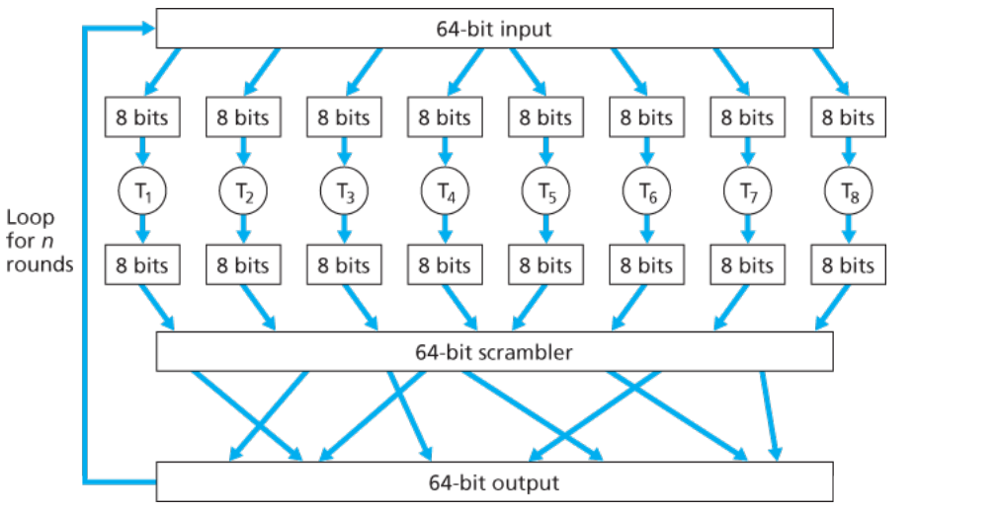
- BC相同块编码后相同，存在被解码风险，因此引出CBC，相同块编码后不同
### CBC(cipher-block chain)[SSL/TLS]

- `Ci = EK(Bi ⊕ Ci-1)`，`Bi = DK(Ci)⊕(Ci-1)`
- 加密只能串行，且不能发生包丢失，解密可以并行，可以忍受包丢失
### CFB(cipher feedback)[AES]

- `Ci = EK(Ci-1) ⊕ Bi`，`Bi = EK(Ci-1)⊕(Ci)`
- 不进行解密操作，速度比CBC更快
### OFB(output feedback)[AES]
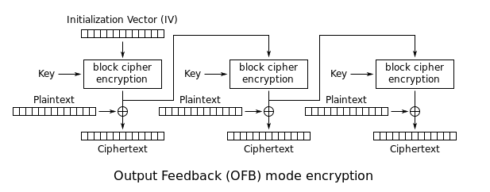
- `Ci = Vi ⊕ Bi`，`Bi = Vi ⊕ Ci`，`Vi = EK(Vi-1)`
- 加密解密均可以并行（IV加密时间较短），不断加密的IV序列可能发生重复
### CTR(counter)[AES]

- `Vi = EK(s+i-1)`，`Ci = Vi ⊕ Bi`，`Bi = Vi ⊕ Ci`
- 简单，安全，高效
- 接收方与发送方需要同步钟
### Diffle-Hellman 算法
- 用于生成对称秘钥
- 需要进行终端身份认证(签名)，避免中间人攻击
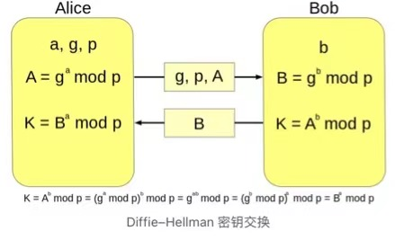
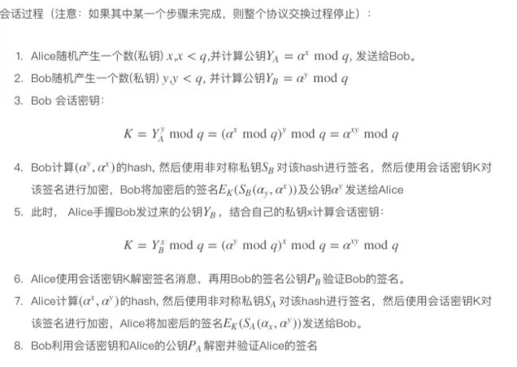

## 非对称加密
### RSA
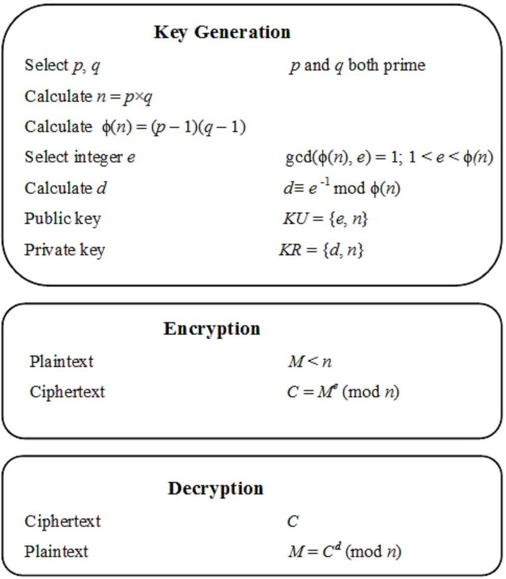
- p和q是两个很大的质数，太小的话容易被破译，太大的话会影响计算速度。通常p和q的大小为1024b。这两个数是通过伪随机数生成器生成的。伪随机数生成器不能直接生成质数，它是通过不断的重试得到的。
- 安全性保障:还没有有效的对大整数进行质因素分解的高效算法

## HASH
- 仅进行HASH，会受到中间人攻击，无法保证信息的真实性
- 通过加盐(salt)与多次hash可提高安全性
- 纯hash只要算力允许均可被破解(比特币的获取)
### 一致性hash
* 平衡性：是指 hash 的结果应该平均分配到各个节点，这样从算法上解决了负载均衡问题。
* 单调性：是指在新增或者删减节点时，不影响系统正常运行。
* 分散性：是指数据应该分散地存放在分布式集群中的各个节点（节点自己可以有备份），不必每个节点都存储所有的数据。
* 抽象性：增加虚拟服务器节点概念，引入中间层，分离出物理层
* redis中集合储存的实现就采用了类似的方法
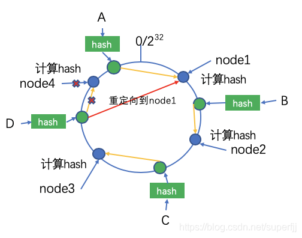

## MAC(message authentication code)
- 利用对称秘钥进行验证信息完整性与终端身份认证
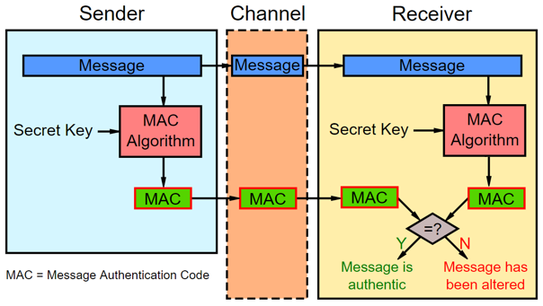
### 对MAC的攻击
- 重放攻击
	- 序列号(seq number)
	- 时间戳(time stamp)
	- 随机数(nonce)

## 签名
- 利用非对称秘钥进行验证信息完整性与终端身份认证
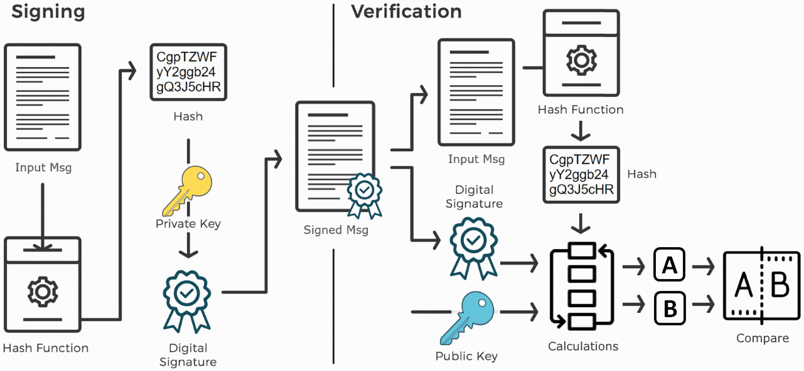

## 证书
- 验证签名的公钥来源的真实性
- 使用CA公钥来获取经过CA认证的其他公钥
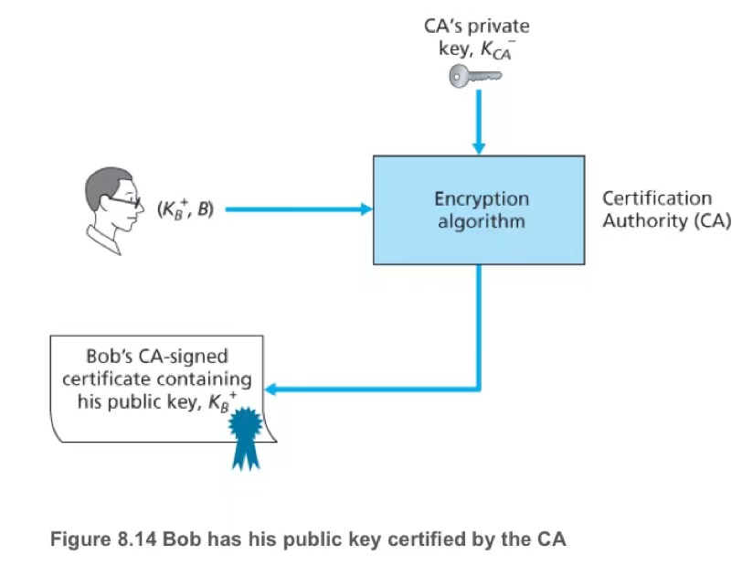
证书格式：
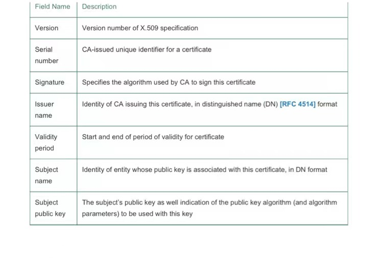

- 针对于PKI体系的攻击
	- 在公钥注册之前替换公钥
	- 窃取CA的私钥
	- 伪装CA
	- CRL(对外的证书废弃列表)时间差攻击

## 实例
### PGP
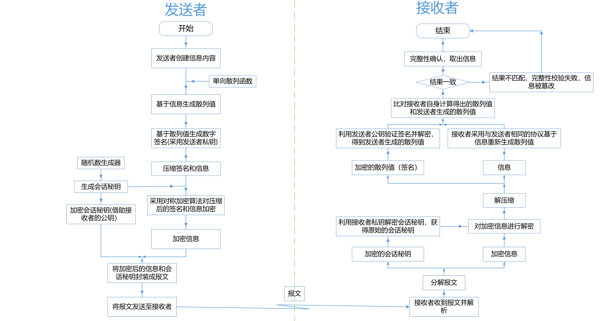

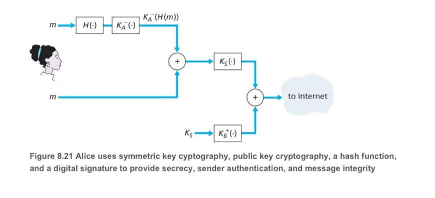
- 由于PGP的执行结果是以二进制数据流的形式呈现的，所以有可能在某些电子邮件系统或者其他无法使用和处理二进制数据流的软件中无法正常的传输PGP的加密数据流，所以PGP提供了二进制数据流与文本数据之间相互转换的功能。当需要进行转换时，PGP会将二进制数据转成ASCII radix-64格式的文本数据。
- radix-64在base64的基础上额外增加了检测数据错误的校验和部分
- 需要注意的是，radix-64会使得消息长度增加三分之一，但是由于在执行radix-64转换之前已经对消息进行了压缩，所以整体来看，消息的长度并未增加太多。
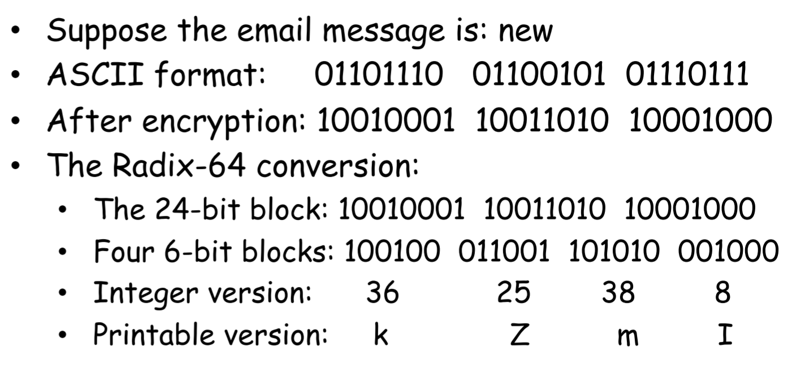
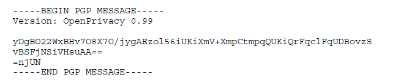

图中`=njUN`即为当前PGP消息的校验和内容
## 参考
https://www.educative.io/answers/what-is-cbc

https://www.researchgate.net/figure/Figure-213-The-RSA-Algorithm_fig12_328828460

http://www.flydean.com/category/encryption/

https://www.ucg.ac.me/skladiste/blog_44233/objava_64433/fajlovi/Computer%20Networking%20_%20A%20Top%20Down%20Approach,%207th,%20converted.pdf

https://marcuseddie.github.io/2019/PGP-Introduction.html

https://zhuanlan.zhihu.com/p/501872243