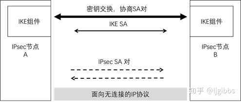
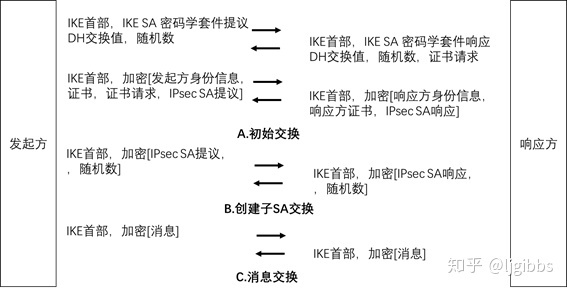
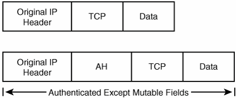
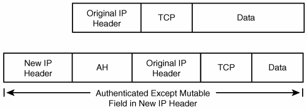
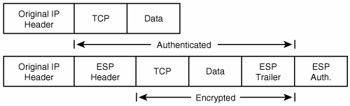
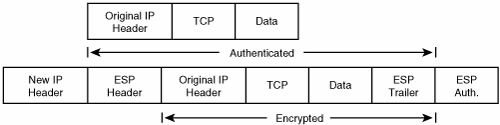
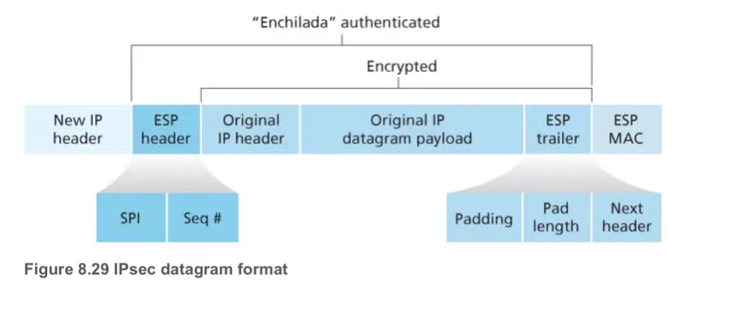

## 概念
### IPsec
IPsec（Internet Protocol Security）是为IP网络提供安全性的协议和服务的集合，它是VPN（Virtual Private Network，虚拟专用网）中常用的一种技术。 通信双方通过IPsec建立一条IPsec隧道，IP数据包通过IPsec隧道进行加密传输，有效保证了数据在不安全的网络环境如Internet中传输的安全性。
### SA(Security Association)
- SA是通信双方对某些协商要素的约定，比如安全套件（RSA_AES_SHA256）、数据传输采用的封装模式(AH,ESP.......)，签名证书等通信双方之间只有建立了SA，才能进行安全的数据传输。
- SA为四元组，由SPI，通讯双方IP，封装模式唯一确定。
### SPI(Security Parameter Index)
携带在ESP或AH中，其长度为32b,辨别可能使用不同加密规则和算法的两个流量流。
## 协议
### IKE
- IKE(v2)协议基于UDP协议，使用 500 端口。

- 初始阶段
	- IKE_SA_INIT,` D-H 密钥+协商的伪随机函数=>IPsec秘钥`
	- IKE_AUTH,认证的目的是为了验证通信双方的身份，防止在前一阶段出现中间人攻击,同时进行第一个 IPsec SA 的协商.
- 子SA交换,大多数场景中，只需要建立第一个 IPsec SA，为可选交换阶段
- 信息交换
### AH
AH协议用来对IP报文进行数据源认证和完整性校验，即用来保证传输的IP报文的来源可信和数据不被篡改，但它并**不提供加密功能**。AH协议在每个数据包的标准IP报文头后面添加一个AH报文头，AH协议对报文的完整性校验的范围是整个IP报文。
- 传输(transport)模式

- 隧道(tunnel)模式

### ESP 
- ESP协议除了对IP报文进行数据源认证和完整性校验以外，还能对数据进行加密。ESP协议在每一个数据包的标准IP报头前方添加ESP Trailer和ESP header。
- 传输(transport)模式

- 隧道(tunnel)模式

- AH和ESP可以单独使用，也可以同时使用。AH和ESP同时使用时，报文会先进行ESP封装，再进行AH封装；IPsec解封装时，先进行AH解封装，再进行ESP解封装。
## 参考
https://info.support.huawei.com/info-finder/encyclopedia/zh/IPsec.html

https://ccie.lol/knowledge-base/ipsec-two-mode/
