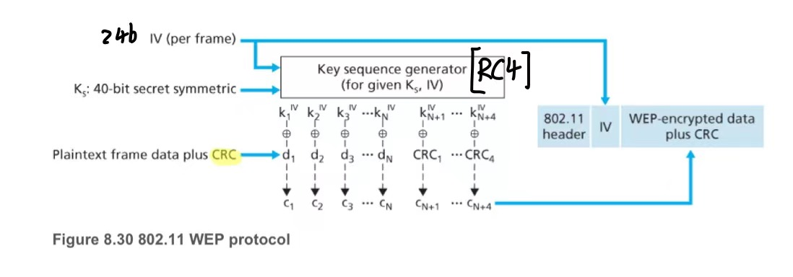
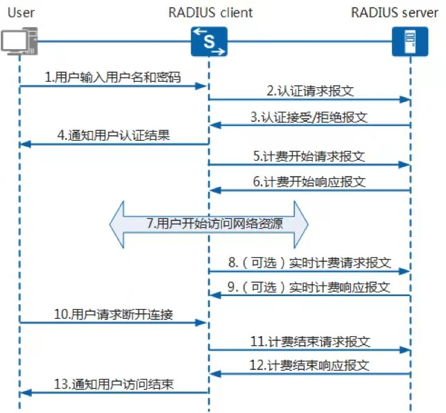
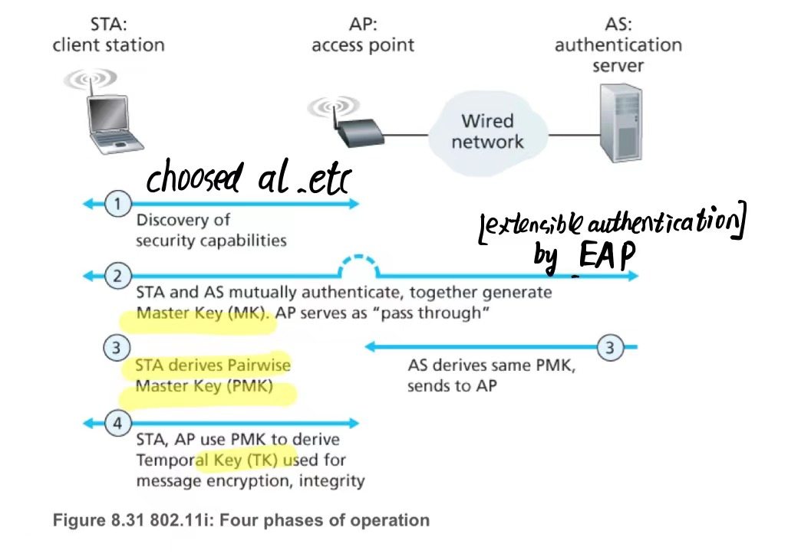
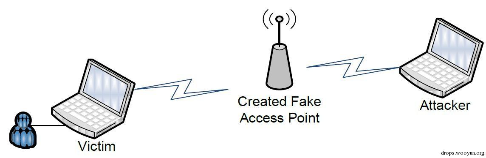
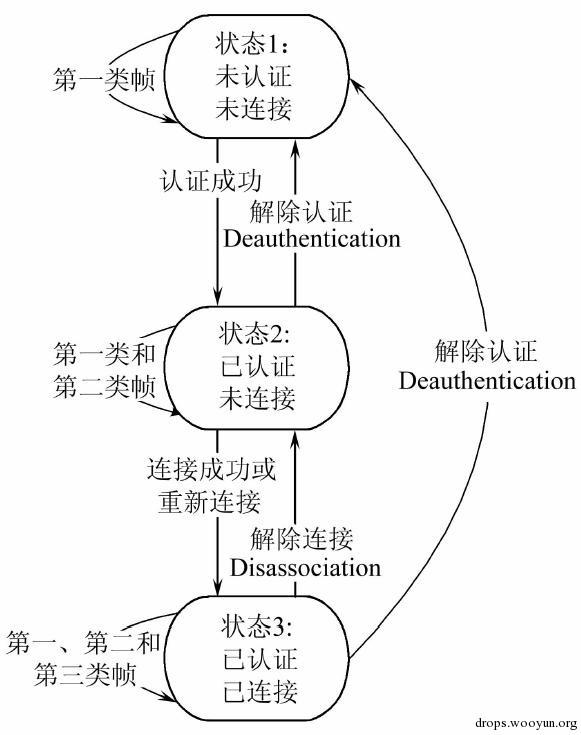

## WEP
### 加密
- WEP 使用流密码 RC4来保证机密性,和CRC-32校验和来保证完整性,于 2004 年被弃用.

### 身份验证
- 开放系统身份验证和共享密钥身份验证
- 在开放系统身份验证中，任何客户端都可以通过接入点进行身份验证，此时，客户端必须拥有正确的密钥。
- 在共享密钥身份验证中，WEP 密钥用于四步质询-响应握手中的身份验证：
	- 客户端向接入点发送身份验证请求。
	- 接入点以明文质询回复。
	- 客户端使用配置的 WEP 密钥对质询文本进行加密，并将其发送回。
	- 接入点解密响应。如果这与质询文本匹配，则接入点会发回一个肯定答复。
- 实际上可以通过抓取质询帧来轻松获得PSK,安全性不高
## WPA
### 认证密钥分发
- WPA-个人
也称为WPA-PSK（预共享密钥）模式，不需要身份验证服务器,PSK在需要使用之前，使用某个安全通道在两方之间共享.
- WPA-企业
也称为WPA- 802.1X模式，需要RADIUS身份验证服务器。
	- UDP:1812认证,1813计费



### 加密协议
- TKIP(Temporal Key Integrity Protocol)
	- TKIP 实现了一个密钥混合功能，将秘密根密钥与初始化向量结合起来，然后将其传递给RC4 密码初始化.相比之下，WEP 只是将初始化向量连接到根密钥，并将该值传递给 RC4 例程。
	- TKIP 实现了一个序列计数器来防止重放攻击
	- TKIP 实现了 64 位MAC并在每次使用新密钥（Temporal Key）时重新初始化序列号
- CCMP (CTR mode with CBC-MAC Protocol)
## WPA2(802.11i) 
### 初始身份验证过程
- PSK 身份验证中，PMK(Pairwise Master Key) 实际上是 PSK，通常是通过使用SHA-1作为HASH的密钥导出函数(KDF)从 WiFi 密码导出的。
- 通过 802.1X（称为EAPOL，需要身份验证服务器的存在）进行EAP交换之后执行。



### 四次握手
- 四次握手前AP广播essid
- 四次握手旨在使接入点和无线客户端可以独立地相互证明他们知道 PSK/PMK，而无需泄露密钥

-`PTK = PMK + ANONCE + SNONCE + MAC[物理地址](STA) + MAC[物理地址](AP)` 
 - MIC( Message Integrity Code)==MAC
- GTK 是一个 AP 到其客户端之间的流量的广播和多播加密。连接到同一 AP 的所有客户端都具有相同的 GTK,而PTK不同

## 伪AP钓鱼攻击

- 获取无线网络的密钥
- 伪造目标无线网络

## 针对AP的DOS攻击
### 无线认证状态

### 认证洪水攻击（Authentication Flood Attack）
### 去认证洪水攻击（Deauthentication Flood Attack）
```
aireplay-ng -0 10 -a [BSSID] [interface in monitor mode]
++
airodump-ng -c 11 --bssid [BSSID] -w /path/to/save/cap [interface in monitor mode]
```
### 关联洪水攻击（Association Flood Attack）
### 去关联洪水攻击（Disassociation Flood Attack）
### RF Jamming攻击
- RF干扰攻击（RF Jamming Attack），是通过发出干扰射频达到破坏正常无线通信的目的
## 参考
http://drops.xmd5.com/static/drops/wireless-15128.html

https://en.wikipedia.org/wiki/Wired_Equivalent_Privacy

https://en.wikipedia.org/wiki/IEEE_802.11i-2004#cite_note-6

https://medium.com/@alonr110/the-4-way-handshake-wpa-wpa2-encryption-protocol-65779a315a64

https://www.cnblogs.com/lsdb/p/10075508.html