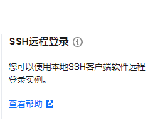
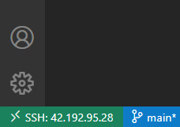
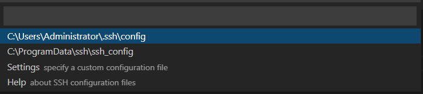
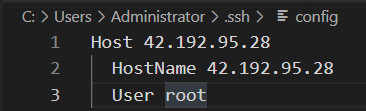
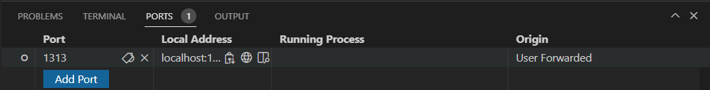

## 腾讯云配置
* 选用轻量应用服务器，Docker基础镜像，Ubuntu20.04-Docker20
* 选用SSH远程登录，按照步骤重置密码，启用SSH功能



* 使用VSCODE的Remote-SSH，方便后续操作



  选择Connect To Host


  选择SSH配置文件



  设置Host为云服务器的公网IP，HostName任意，User为你的linux用户



  登入后终端显示为`<User>@VM-4-16-ubuntu:/# `,配置完成

## HUGO配置
* 根据[klakegg/hugo](https://hub.docker.com/r/klakegg/hugo/)步骤配置HUGO in DOCKER,[官方教程](https://gohugo.io/getting-started/quick-start/)
```
$ mkdir /etc/docker/hugo //配置文件储存位置
$ cd /etc/docker/hugo
$ docker pull klakegg/hugo:0.101.0-ext-ubuntu
//注意这里的TAG，不能是latest,否则后续的theme安装可能后出现问题！
//不同的TAG含义可见文档

$ docker run --rm -it \
  -v $(pwd):/src \
  -p 1313:1313 \
  klakegg/hugo:0.101.0-ext-ubuntu \
  shell
//进入SHELL，退出使用ctrl+D

hugo/src$:hugo new site My_site 
//创建新网站

hugo:/src$ cd ./My_site
hugo:/src/My_site$ ls 
archetypes  config.toml  content  data  layouts  public  static  themes

hugo:/src/My_site$ git init
hugo:/src/My_site$ git submodule add https://github.com/CaiJimmy/hugo-theme-stack/ themes/hugo-theme-stack
//git初始化，选择适合的主题，把主题添加为Submodule
//根据所选的主题要求调整配置文件,这里选用的是hugo-theme-stack

hugo:/src/My_site$ hugo server
...
Running in Fast Render Mode. For full rebuilds on change: hugo server --disableFastRender
Web Server is available at //localhost:1313/ (bind address 0.0.0.0)
Press Ctrl+C to stop
```
VSCODE配置端口映射

之后可通过//localhost:1313/直接访问

常见问题:
```
ERROR 2022/06/26 06:31:48 Failed to get JSON resource "https://publish.twitter.com/oembed?dnt=false&omit_script=true&url=https%3A%2F%2Ftwitter.com%2FDesignReviewed%2Fstatus%2F1085870671291310081": Get "https://publish.twitter.com/oembed?dnt=false&omit_script=true&url=https%3A%2F%2Ftwitter.com%2FDesignReviewed%2Fstatus%2F1085870671291310081": dial tcp 103.252.114.61:443: i/o timeout
If you feel that this should not be logged as an ERROR, you can ignore it by adding this to your site config:
ignoreErrors = ["error-remote-getjson"]
Error: Error building site: "/src/content/post/rich-content/index.en.md:1:1": timed out initializing value. You may have a circular loop in a shortcode, or your site may have resources that take longer to build than the `timeout` limit in your Hugo config file.
Built in 30251 ms
```
部分主题带有404网站的资源，根据提示删除`"/src/content/post/rich-content/index.en.md:1:1"`中的404内容即可
## THEME配置
* 选用主题为[hugo-theme-stack](https://github.com/CaiJimmy/hugo-theme-stack),不同主题调整的方法不同
#### 调整默认语言
在`config.yaml`中根据注释调整语言
```
languages:
    zh-cn:
        languageName: 中文
        title: 演示站点
        weight: 1
    en:
        languageName: English
        title: Example Site
        weight: 2
		
# Theme i18n support
# Available values: ar, bn, ca, de, el, en, es, fr, hu, id, it, ja, ko, nl, pt-br, th, uk, zh-cn, zh-hk, zh-tw
DefaultContentLanguage: zh-cn

# Set hasCJKLanguage to true if DefaultContentLanguage is in [zh-cn ja ko]
# This will make .Summary and .WordCount behave correctly for CJK languages.
hasCJKLanguage: true
```
并把`content`文件夹中
```
index.zh-ch.md->index.md
index.md->index.en.md
```
重启`hugo server`即可生效
#### 调整页面布局(根据个人需要)
```
//FILE=/etc/docker/hugo/My_site/assets/scss/grid.scss
.container {
 &.extended {
        @include respond(md) {//中等屏幕显示
            max-width: 1024px;
            --left-sidebar-max-width: 25%->12%;
            --right-sidebar-max-width: 30%->20%;
        }

        @include respond(lg) {//大屏幕显示
            max-width: 1280px;
            --left-sidebar-max-width: 20%->12%;
            --right-sidebar-max-width: 30%->20%;
        }

        @include respond(xl) {//超大屏幕显示
            max-width: 1800px;
            --left-sidebar-max-width: 15%->12%;
            --right-sidebar-max-width: 25%->20%;
        }
    }
}
```

```
//FILE=/etc/docker/hugo/My_site/assets/icons/brand-bilibili.svg
<svg height="1153" viewBox="-.64 -4.64 2187.5 1004.88" width="2500" xmlns="http://www.w3.org/2000/svg"><path d="m2030.61 892.82c-9.77 0-18.55 0-26.37-.98-16.6-.97-33.2-1.95-49.8-1.95-10.74 0-10.74 0-11.72-10.74l-15.63-177.74-15.62-147.46-10.74-90.82-9.77-79.1-17.58-123.05c-5.86-43.94-12.69-86.91-21.48-130.86-.98-6.83-.98-7.81 6.84-8.79 30.27-5.86 61.52-8.79 92.77-8.79h10.74c4.88.98 7.81 3.91 8.79 9.77l3.91 67.38 27.34 364.26 13.67 166.99 8.79 95.71zm-1197.27-780.28h17.58c8.79 0 10.74 2.93 10.74 11.72l7.82 118.17 17.58 245.11 10.74 127.93 7.81 98.64 15.63 169.92c0 7.81-.98 8.79-8.79 8.79l-70.32-2.93c-4.88.98-7.81-1.95-7.81-6.84l-2.93-34.18c-2.93-29.29-5.86-58.59-7.81-88.86l-15.63-154.3-16.6-139.65-11.72-98.63-12.69-89.85c-5.86-40.04-12.7-81.05-19.53-121.09l-4.89-27.34c-.97-4.89 0-6.84 4.89-7.82 27.34-4.88 53.71-9.76 85.93-8.79zm982.43 393.56c24.41 0 27.34.98 31.25 24.41 4.88 29.3 8.79 58.6 11.72 87.89l10.74 94.73 20.51 201.17c.97 4.89 0 6.84-4.89 6.84l-76.17 8.79c-7.81.97-9.77 0-10.74-7.81l-43.95-224.61-27.34-149.42-3.91-20.51c-.97-3.9.98-6.83 4.89-7.81 30.27-6.83 59.57-11.72 87.89-13.67zm-1110.36 0c26.37-.98 29.3 1.95 32.23 26.37 6.84 40.04 11.72 79.1 15.63 119.14l12.69 117.18 7.81 79.11 6.84 63.47c0 8.79-.98 10.75-8.79 11.72l-72.26 6.84c-7.82.97-9.77 0-10.75-7.81l-59.57-306.65-15.62-86.91c-.98-4.88.97-7.81 5.86-8.79 30.27-6.83 58.59-11.72 85.93-13.67zm373.05 302.73v125c.98 5.86-1.95 8.79-7.81 7.82h-23.44c-16.6 0-33.2.97-49.8 1.95-8.79.98-9.77.98-10.75-9.77l-15.62-175.78-7.81-86.91-11.72-132.81c-.98-10.75.98-12.7 9.76-13.68 27.35-2.93 54.69-2.93 82.04-1.95l20.5 2.93c7.82 2.93 8.79 3.91 8.79 11.72l2.93 52.73.98 58.6c.98 53.71 1.95 106.44 1.95 160.15zm1108.4 5.86v120.12c0 4.88-1.95 7.81-6.84 6.84h-35.15c-13.67 0-27.35.97-40.04 1.95-7.81.98-8.79 0-9.77-8.79l-20.5-228.52-10.75-113.28-3.9-57.61c-.98-7.82.97-9.77 8.79-9.77 32.22-3.91 65.43-4.88 97.65-.98 12.7.98 14.65 4.89 15.63 17.58l2.93 129.88zm-399.41-516.6c9.76 0 18.55.98 25.39 1.95 4.88.98 6.83 2.93 7.81 7.82l12.69 135.74c2.93 11.72.98 13.67-10.74 13.67l-33.2 1.95c-6.84.98-9.77 1.96-9.77-8.78l-13.67-110.36-3.9-31.25c-.98-5.86.97-8.79 6.83-9.76zm-1106.45 0c7.81 0 15.63.98 22.46 1.95 3.91.98 5.86 2.93 6.84 7.82l3.9 34.18 9.77 106.44c.98 7.81.98 8.79-6.84 8.79l-38.08 1.95c-7.81.98-8.79 0-9.77-7.81l-8.79-78.12-7.81-65.43c-.98-4.89.98-7.82 5.86-7.82 6.84-.97 14.65-1.95 22.46-1.95zm389.65 97.66v67.38c.98 10.74-.98 10.74-9.77 10.74-12.69 0-24.41-.97-36.13-1.95-7.81-.98-8.79-.98-7.81-8.79l-2.93-83.01c0-18.55 0-37.11-.98-55.66-.97-8.79 0-9.77 8.79-9.77 13.67 0 27.34.98 41.02 2.93 7.81 0 7.81 1.96 7.81 9.77zm1109.37.97v67.39c0 8.79-.97 9.76-9.76 9.76l-37.11-1.95c-5.86-.98-8.79-3.91-7.81-8.79l-2.93-139.65c0-7.81.97-8.79 8.79-8.79 12.69 0 24.41.98 36.13 1.96 14.65.97 12.69 3.9 12.69 14.64zm-1529.29 52.74c.97 11.72 0 13.67-11.72 14.65l-23.44 5.86c-7.81 2.93-8.79.97-9.76-5.86l-24.42-137.7c-2.93-8.79-.98-10.74 7.81-11.72l34.18-5.86c7.82-.97 9.77-.97 9.77 6.84 2.93 16.6 5.86 33.2 7.81 49.8l9.77 78.13zm1039.06-133.79c14.65-2.93 30.27-4.88 45.9-6.84 4.88-.97 6.83 1.96 7.81 6.84l7.81 53.71c3.91 26.37 6.84 52.73 7.82 79.1v7.81c.97 3.91-.98 6.84-4.89 7.82l-31.25 6.83c-4.88.98-6.83-.97-7.81-5.86l-25.39-145.5zm-693.36 105.47c0 15.62-.98 30.27-1.95 43.94 0 4.89-1.96 6.84-6.84 7.82l-30.27 2.93c-4.88.97-6.84-1.96-6.84-6.84-1.95-14.65-2.93-28.32-3.9-42.97-1.96-26.37-3.91-53.71-4.89-81.05l-1.95-19.53c-.98-3.91.98-5.86 4.88-5.86l40.04-2.93c6.84 0 8.79.97 8.79 8.79zm1107.42-15.63c.98 18.56.98 38.09 0 56.64.98 8.79-.97 10.75-9.76 10.75l-27.35 2.93c-4.88.97-7.81-1.96-7.81-6.84-.98-24.41-2.93-49.8-4.88-74.22l-3.91-68.36c-.98-4.88.98-6.83 4.88-6.83l39.07-2.93c6.83 0 7.81.97 7.81 8.79 1.95 26.36 2.93 53.71 1.95 80.07zm-1491.21 333.01c15.63 18.56 18.56 39.06 11.72 61.52-5.86 21.49-16.6 40.04-32.23 55.67-25.39 26.37-54.68 47.85-86.91 64.45-55.66 29.3-113.28 49.81-174.81 60.55-43.94 8.79-87.89 14.65-131.83 17.58-13.67.97-27.34.97-41.02.97h-29.29c-7.82 0-9.77-1.95-10.75-9.76l-6.83-94.73-18.56-186.52-20.5-177.74-11.72-94.72-12.7-90.82c-6.83-49.81-15.62-99.61-24.41-149.42-6.84-40.04-13.67-80.08-22.46-120.11-.98-4.89 0-8.79 4.88-9.77l135.74-56.64c8.79-3.91 16.6-6.84 25.39-8.79 5.86-.98 8.79.98 7.81 6.84 0 15.62 0 31.25-.97 47.85l-.98 12.69c-.97 56.64-.97 113.28 0 170.9.98 49.81 3.91 100.59 6.84 150.39 4.88 78.13 12.69 156.25 20.51 233.4 0 7.81.97 7.81 9.76 6.84 16.6-2.93 32.23-3.91 48.83-3.91 51.76 0 103.51 5.86 153.32 18.55 43.94 10.75 85.94 25.4 127.93 43.95 20.51 9.77 39.06 21.48 56.64 35.16 6.84 4.88 11.72 9.76 16.6 15.62zm1100.59-8.79c20.51 16.6 27.34 39.06 21.48 65.43-4.88 21.49-14.65 40.04-29.3 56.64-23.43 26.37-50.78 46.88-81.05 63.48-58.59 32.23-121.09 54.69-187.5 66.41-36.13 6.83-72.27 12.69-108.4 15.62-20.51 1.95-42.97 2.93-65.43 1.95h-26.37c-5.85.98-8.78-1.95-8.78-7.81-1.96-27.34-3.91-54.69-6.84-82.03l-15.63-166.99-16.6-145.51-20.5-164.06c-2.93-28.32-6.84-57.62-11.72-85.94l-17.58-109.38c-7.81-51.75-17.58-103.51-28.32-155.27l-.98-6.83c-1.95-4.89 0-8.79 4.88-9.77 47.86-19.53 94.73-41.02 142.58-59.57 12.7-4.88 28.32-10.74 27.35.98-3.91 36.13-2.93 72.26-3.91 107.42-.98 29.29-.98 58.59.98 86.91v22.46c0 35.16.97 70.32 3.9 104.49 1.96 45.9 4.89 92.78 8.79 138.68l8.79 98.63c.98 18.55 2.93 36.13 5.86 54.69 0 10.74 1.95 9.76 10.74 8.79 17.58-2.93 35.16-3.91 52.74-3.91 61.52.98 121.09 10.74 179.68 27.34 40.04 10.75 78.13 25.39 115.24 44.93 16.6 8.78 31.25 19.53 45.9 32.22zm-1412.11 171.88c14.65-8.79 40.04-26.37 75.19-53.71 35.16-28.32 56.64-46.88 65.43-56.64-52.73-23.44-107.42-43.95-164.06-62.5zm1247.07-105.47c2.93-2.93 1.95-4.88-.98-6.84l-23.44-9.76c-41.01-17.58-82.03-33.21-124.02-46.88l-5.86-1.95c-1.95-.98-3.9 0-6.83.98l23.43 168.94c2.93 0 4.89-.98 5.86-1.95 38.09-27.35 76.17-55.67 114.26-85.94z" fill="#07a3d7"/></svg>
```
```
//FILE=/etc/docker/hugo/My_site/config.yaml
    social:
        - identifier: github
          name: GitHub
          url: https://github.com/gxherror
          params:
              icon: brand-github

        - identifier: bilibili
          name: Bilibili
          url: https://space.bilibili.com/36707116
          params:
              icon: brand-bilibili
```
```
//FILE=/etc/docker/hugo/My_site/assets/ts/gallery.ts
//禁用图片的描述文字显示
// Add figcaption if it exists
//if (img.hasAttribute('alt')) {
//   const figcaption = document.createElement('figcaption');
//    figcaption.innerText = img.getAttribute('alt');
//    figure.appendChild(figcaption);
//}
```