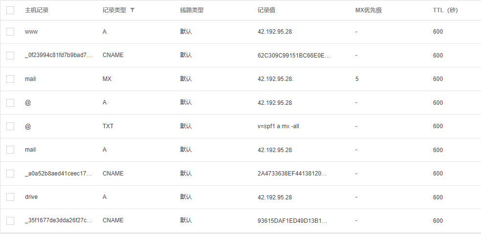
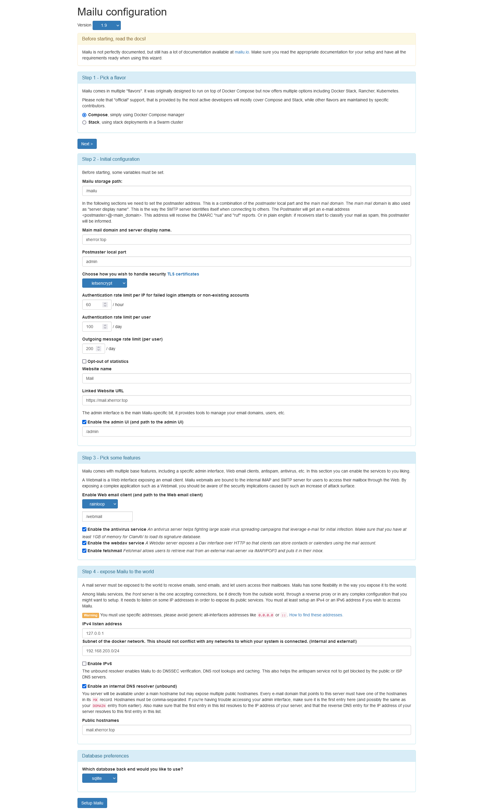

## 准备
1. 注册域名`xherror.top`
2. DNS配置

其中TXT记录用于mail反垃圾,CNAME记录用于CA认证
## web:hugo+nginx
[官网](https://gohugo.io/getting-started/quick-start/)
- `hugo`详细的部署可见[云上使用DOCKER部署HUGO](https://www.xherror.top/post/tools/hugo-in-docker-on-cloud/)
- 这里是利用`nginx`作为静态web服务器,访问`hugo`生成的`/public`下的资源
配置`docker-compose.yml`如下
```
services:
  nginx:
    container_name: nginx
    image: nginx:latest
    volumes:
      - "/path/to/nginx/nginx.conf:/etc/nginx/nginx.conf"
      - "/path/to/nginx/cert:/etc/nginx/cert"#
      - "/path/to/hugo/your_site/public:/etc/nginx/public"
      - "/var/log/nginx:/var/log/nginx"
    ports:
      - "80:80"
      - "443:443"
   
```
配置`nginx.conf`如下
```shell
    #hugo
    server {
        listen 80 ; 
        server_name www.xherror.top  xherror.top; 
        location / {
            root /etc/nginx/public;        
            index index.html;
            error_page 404 404.html;
            
        }
    }
```
之后`docker-compose up -d`启动服务通过`docker ps|grep nginx`查看容器是否正常运行,此时即可通过`http://xherror.top`访问个人博客
## mail:mailu
[官网](https://mailu.io/1.9/compose/setup.html#)

利用[mailu setup utility](https://setup.mailu.io/1.9/)生成所需的`docker-compose.yml`与`mailu.env`

因为通过`nginx`反向代理来访问mail,修改`docker-compose.yml`中`front`部分内容,不映射端口`80`与`443`,注意端口`25`需要设置对公网开放
```
# Core services
  front:
    image: ${DOCKER_ORG:-mailu}/${DOCKER_PREFIX:-}nginx:${MAILU_VERSION:-1.9}
    restart: always
    env_file: mailu.env
    logging:
      driver: json-file
	   expose:
      - "80" #HTTP
      - "443" #HTTPS
    ports:
      - "25:25" #STMP
      - "465:465" #STMP over SSL
      - "587:587" #Submission
      - "110:110" #pop3
      - "995:995" #pop3 voer SSL
      - "143:143" #imap
      - "993:993" #imap ove SSL
    volumes:
      - "/mailu/certs:/certs"
      - "/mailu/overrides/nginx:/overrides:ro"
    depends_on:
      - resolver
    dns:
      - 192.168.203.254
```
之后`docker-compose up -d`启动服务通过`docker ps|grep mailu`查看容器是否正常运行

## drive:filebrowser
[官网](https://filebrowser.org/)
创建`docker-compose.yml`配置如下
```
services:
  filebrowser:
    container_name: filebrowser
    image: filebrowser/filebrowser:s6
    volumes:
      - /path/to/root:/srv
      - /path/to/filebrowser.db:/database/filebrowser.db
      - /path/to/settings.json:/config/settings.json
    environment:
      - PUID=0 #$(id -u)
      - PGID=0 #$(id -g)
    expose:
      - "80"
```
下载默认的`setting.json`
```
{
    "port": 80,
    "baseURL": "",
    "address": "",
    "log": "stdout",
    "database": "/database/filebrowser.db",
    "root": "/srv"
}
```
之后`docker-compose up -d`启动服务通过`docker ps|grep filebrowser`查看容器是否正常运行

## container通讯
将`nginx`,`mailu_front_1`与`filebrowser`添加到同一网段
```shell
root@VM-4-16-ubuntu:/etc/docker# docker network  create wmds_net
root@VM-4-16-ubuntu:/etc/docker# docker network connect  wmds_net nginx
root@VM-4-16-ubuntu:/etc/docker# docker network connect  wmds_net filebrowser
root@VM-4-16-ubuntu:/etc/docker# docker network connect  wmds_net mailu_front_1
root@VM-4-16-ubuntu:/etc/docker# docker network inspect wmds_net
"Containers": {
							..........
                "Name": "nginx",
                "IPv4Address": "172.25.0.2/16",
							..........
                "Name": "mailu_front_1",
                "IPv4Address": "172.25.0.4/16",
							..........
                "Name": "filebrowser",
                "IPv4Address": "172.25.0.3/16",
							..........
        },
```
之后`nginx`可通过该内网段进行反向代理

## ssl:腾讯云证书
利用腾讯云申请免费SSL证书,再自行下载安装,之后再试试`acme.sh`
配置`nginx.conf`如下
```
    #hugo static content
    server {
        listen 80;
        server_name www.xherror.top xherror.top;
        return 301 https://$host$request_uri; 
         }
    server {
        #SSL 访问端口号为 443
        listen 443 ssl; 
        #填写绑定证书的域名
        server_name www.xherror.top  xherror.top; 
        #证书文件名称
        ssl_certificate cert/xherror.top.pem; 
        #私钥文件名称
        ssl_certificate_key cert/xherror.top.key; 
        ssl_session_timeout 5m;
        #请按照以下协议配置
        ssl_protocols TLSv1.2 TLSv1.3; 
        #请按照以下套件配置，配置加密套件，写法遵循 openssl 标准。
        ssl_ciphers ECDHE-RSA-AES128-GCM-SHA256:HIGH:!aNULL:!MD5:!RC4:!DHE; 
        ssl_prefer_server_ciphers on;
        location / {
            root /etc/nginx/public;        
            index index.html;
            error_page 404 404.html;
            
        }
    }
	
	  #filebrowser 
    server {
        listen 80;
        server_name drive.xherror.top;
        return 301 https://$host$request_uri; 
        
    }
    server { 
        listen 443 ssl; 
        server_name drive.xherror.top;
        ssl_certificate cert/drive.xherror.top.pem; 
        ssl_certificate_key cert/drive.xherror.top.key; 
        ssl_session_timeout 5m;
        ssl_protocols TLSv1.2 TLSv1.3; 
        ssl_ciphers ECDHE-RSA-AES128-GCM-SHA256:HIGH:!aNULL:!MD5:!RC4:!DHE; 
        ssl_prefer_server_ciphers on;
        location / {
            proxy_pass  http://172.25.0.3:80; #这里的地址为wmds_net中filebrowser 的地址
            proxy_set_header Host $proxy_host;#修改转发请求头，让8080端口的应用可以受到真实的请求
            proxy_set_header X-Real-IP $remote_addr;
            proxy_set_header X-Forwarded-For $proxy_add_x_forwarded_for;
        }
    }
			#mailu
			......
```
至此WMDS全部配置完成,[web](https://xherror.top/),[mail](https://mail.xherror.top/),[drive](https://drive.xherror.top/)
## 参考
https://cloud.tencent.com/document/product/400/4143

https://zhuanlan.zhihu.com/p/108740468